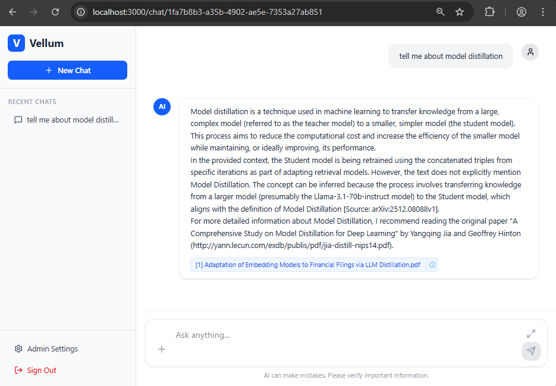

# Vellum Enterprise Chatbot

An enterprise-grade chatbot featuring Entra ID SSO, Multi-LLM support (GPT-4, Gemma, Llama 3, Mistral), and an advanced RAG pipeline using LlamaIndex.

## 🚀 Quick Start (Docker)

The fastest way to get started is using Docker Compose.

**Configure Environment**:
Create a `.env` file at the root (copy from `.env.example`).
```env
# Required for minimal setup
OPENAI_API_KEY="" # Optional if using Ollama
BYPASS_AUTH=true
VITE_BYPASS_AUTH=true
PROJECT_NAME=Vellum
```

**Launch**:
```powershell
# Windows
.\launch-docker.ps1

# Linux/Mac
./launch-docker.sh
```

> **Note**: The first startup may take **15-20 minutes** (depending on internet speed) as the system automatically downloads the requested LLM models: **Mistral**, **Llama 3**, **Gemma 2**, **Llama 3.2**, and others. Watch the container logs for "All models provisioned".

**Access the App**: [http://localhost:3000](http://localhost:3000)

---

## 📋 Table of Contents

- [Features](#features)
- [Tech Stack](#tech-stack)
- [Architecture](#architecture)
- [Configuration](#configuration)
- [Manual Installation](#manual-installation)
- [Local Model Setup](#local-model-setup)
- [Project Structure](#project-structure)
- [Troubleshooting](#troubleshooting)

## Features

**🤖 Multi-LLM Support**:

-   **Cloud**: OpenAI GPT-4, Google Gemini.
-   **Local**: Ollama integration running **Llama 3**, **Mistral 7B**, **Gemma 2**.

**📚 Advanced RAG Pipeline**:
-   **Semantic Chunking**: Context-aware text splitting.
-   **Hybrid-Ready Search**: LlamaIndex + ChromaDB vector store.
-   **Multimodal Ingestion**: Supports PDFs, DOCX, and rich text with tables.

**🔐 Enterprise Security**:
-   **SSO**: Microsoft Entra ID (Azure AD) integration.
-   **Air-Gapped Ready**: Fully local execution capability.

**🎨 Modern UI**:
-   **Chat Interface**: Real-time streaming, markdown rendering, code highlighting.
-   **Admin Dashboard**: Manage models and active configurations.
-   **Theme**: Clean, responsive layout built with Tailwind CSS.




> **Note**: Currently this application demonstrates a secure, air-gapped capable AI assistant designed to ingest technical PDF papers and provide accurate, citation-backed answers for enterprise use cases.

## Tech Stack

### Frontend


-   **Framework**: React 19 + Vite
-   **Styling**: Tailwind CSS v4, Framer Motion
-   **Auth**: MSAL (`@azure/msal-react`)
-   **Markdown**: `react-markdown`, `remark-gfm`

### Backend


-   **API**: FastAPI (Python 3.12)
-   **Orchestration**: LlamaIndex
-   **Vector DB**: ChromaDB (Persistent)
-   **LLM Serving**: Ollama (Dockerized)

## Architecture

The system uses a **Retrieval-Augmented Generation (RAG)** architecture:
1.  **Ingestion**: Documents in `data/source_documents` are loaded.
2.  **Indexing**: Text is split semantically and embedded using `BAAI/bge-large-en`.
3.  **Storage**: Embeddings are stored in ChromaDB (`data/chroma`).
4.  **Retrieval**: User queries fetch relevant chunks (k=5).
5.  **Synthesis**: The active LLM (e.g., Mistral) generates a response using the chunks as context.

## Configuration

The application is configured via `.env` file.

| Variable | Description | Default |
| :--- | :--- | :--- |
| `PROJECT_NAME` | Name of the app | `Vellum` |
| `OPENAI_API_KEY` | For GPT-4 support | - |
| `AZURE_CLIENT_ID` | For SSO | - |
| `BYPASS_AUTH` | Skip backend auth check | `false` |
| `VITE_BYPASS_AUTH` | Skip frontend login | `false` |

## Manual Installation

If you prefer running without Docker:

### Prerequisites
-   Node.js 23+
-   Python 3.12+
-   Ollama (Installed locally)

### Steps
1.  **Frontend**:
    ```bash
    cd frontend
    npm install
    npm run dev
    ```
2.  **Backend**:
    ```bash
    cd backend
    python -m venv venv
    source venv/bin/activate # or venv\Scripts\activate
    pip install -r requirements.txt
    uvicorn main:app --reload
    ```
3.  **Ollama**:
    Run `ollama serve` and pull models manually: `ollama pull mistral`.

## Project Structure

```
Vellum/
├── backend/            # FastAPI Application
│   ├── app/            # Source code
│   ├── data/           # Persistent data (Chroma, Docs)
├── frontend/           # React Application
├── scripts/            # Infrastructure scripts
├── docker-compose.yml  # Deployment config
└── README.md           # Documentation
```

## Troubleshooting

-   **"Failed to fetch"**: Ensure Backend is running on port 8000.
-   **"Ollama connection refused"**: Ensure `OLLAMA_BASE_URL` is correct. In Docker it is `http://ollama:11434`.
-   **"Token validation failed"**: Set `BYPASS_AUTH=true` for local dev.
