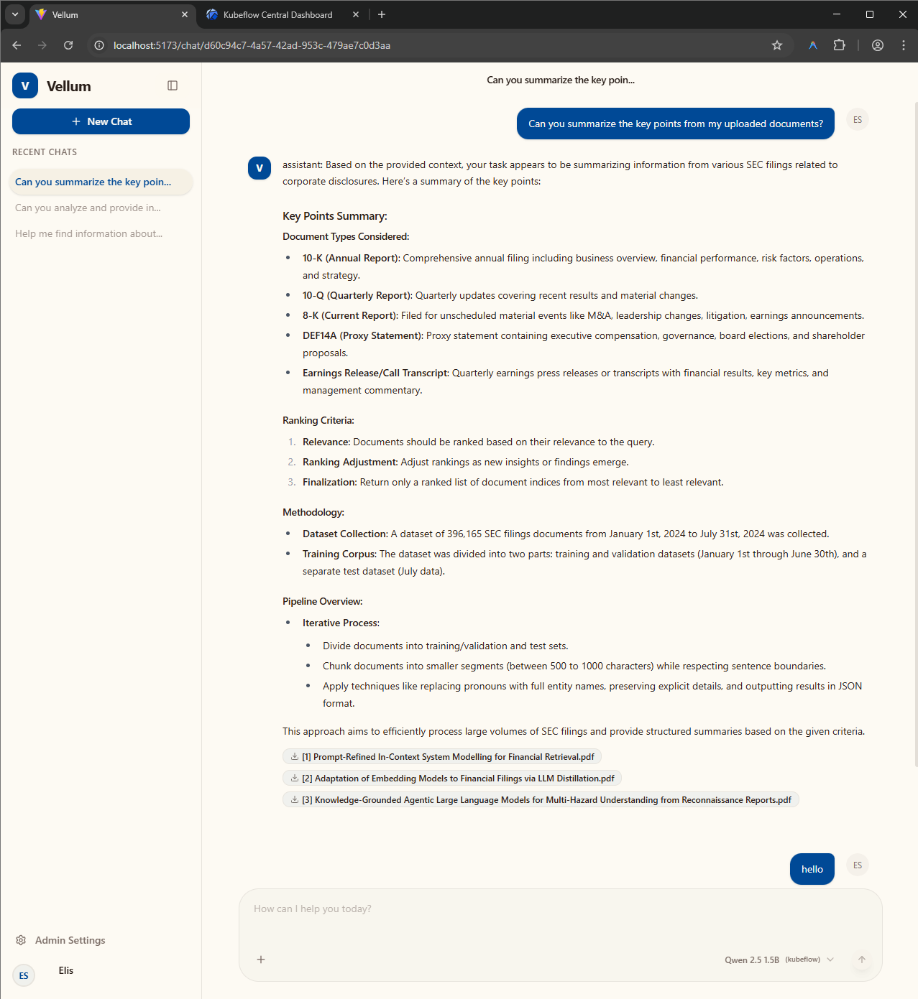

# Vellum Enterprise Chatbot

An enterprise-grade chatbot featuring Entra ID SSO, Multi-LLM support, and an advanced RAG pipeline orchestrated by **Kubeflow**.



## 🚀 Quick Start (Kubernetes)

This platform is designed to run on **Kubernetes**, with **Kind** as the active local development runtime in the current migration phase.

**Prerequisites**:
- Docker & Kind
- `kubectl` & `helm`
- **uv** (Python 3.12+ package manager)
- **pnpm** (Node.js package manager)

**Launch Platform**:
```bash
./scripts/setup-kind.sh
```
*This script bootstraps the local `kind` cluster, applies the Phase 1 slim Kubeflow stack, and prepares the environment for app deployment.*

**Access Services**:
After setup, use the connect script to port-forward all services:
```bash
./scripts/connect.sh
```

| Service | Local URL |
| :--- | :--- |
| **Frontend** | [http://localhost:9090](http://localhost:9090) |
| **Backend API** | [http://localhost:8000](http://localhost:8000/docs) |
| **Kubeflow Dashboard** | [http://localhost:8080](http://localhost:8080) |
| **MinIO API** | [http://localhost:9000](http://localhost:9000) |

---

## 📖 Documentation Hub

Comprehensive documentation is located in the [**docs/**](./docs/README.md) directory.

| Guide | Description |
| :--- | :--- |
| 🚀 [**Getting Started**](./docs/guides/GETTING_STARTED.md) | First-time installation, prerequisites, and Kind setup. |
| 💻 [**Development Guide**](./docs/guides/DEVELOPMENT.md) | Running locally, hybrid development mode, and critical commands. |
| 🏰 [**Architecture**](./docs/context/ARCHITECTURE.md) | Deep dive into the stack, project structure, and code conventions. |
| 🔐 [**Authentication**](./docs/guides/AUTHENTICATION.md) | Details on Entra ID SSO, Dex, and security configuration. |
| 🧪 [**RAG Ingestion**](./docs/guides/INGESTION_VERIFICATION.md) | How to trigger and verify the Kubeflow ingestion pipeline. |

---

## 📋 Table of Contents

- [Features](#features)
- [Architecture](#architecture)
- [Tech Stack](#tech-stack)
- [Configuration](#configuration)
- [Ingestion Pipeline](#ingestion-pipeline)
- [Project Structure](#project-structure)
- [Development & Testing](#development--testing)
- [Troubleshooting](#troubleshooting)

## Features

**🤖 Multi-LLM Support**:
-   **Cloud**: OpenAI GPT-4, Google Gemini.
-   **Local**: Self-hosted LLMs via KServe/LocalAI (Llama 3, Mistral).

**📚 Advanced RAG Pipeline**:
-   **Orchestration**: Kubeflow Pipelines (KFP) for reliable, scalable ingestion.
-   **Vector Store**: Qdrant (Production Grade).
-   **Embeddings**: Dedicated **Text Embeddings Inference (TEI)** service.
-   **Source Diversity**: MMR (Maximal Marginal Relevance) & Unique File Post-processing.

**🔐 Enterprise Security**:
-   **SSO**: Microsoft Entra ID (Azure AD) integration.
-   **Air-Gapped Ready**: Fully containerized architecture.

## Architecture

Vellum is built on a **Decoupled Microservices Architecture** designed for high scalability and enterprise security.

### 🌐 System Overview

- **Frontend**: A premium React 19 application inspired by Claude's design language. Features a perceptually uniform OKLCH color system, refined typography, and an adaptive "Relative Push" sidebar for a seamless desktop experience. Includes native Entra ID SSO.
- **Backend (API Gatekeeper)**: A lightweight FastAPI service that manages user sessions, chat history, and retrieval-augmented generation (RAG) queries.
- **Distributed Ingestion**: Orchestrated by **Kubeflow Pipelines (KFP)**, handling document parsing, semantic chunking, and vectorization in isolated ML-optimized environments.
- **Vector Storage**: **Qdrant** provides high-performance vector search and metadata filtering.
- **AI Infrastructure**:
    - **Embeddings**: Dedicated **TEI** (`text-embeddings-inference`) service for low-latency vectorization.
    - **Inference**: Support for external LLM providers (OpenAI, Gemini) and self-hosted models via **KServe**.

### 🏗️ Design Principles

1. **Decoupled Execution**: Heavy ML workloads are strictly isolated from the API path, ensuring the backend remains responsive and lightweight.
2. **Kubeflow Native**: Every data move is tracked and versioned through the Kubeflow ML platform.
3. **Security First**: mTLS via **Istio** and identity-aware proxying via **Dex**.

For a deep dive into the system components and a detailed architecture diagram, see [**docs/context/ARCHITECTURE.md**](./docs/context/ARCHITECTURE.md).

## Tech Stack

### Frontend


-   **Framework**: React 19 + Vite 7
-   **Styling**: Tailwind CSS 4 (OKLCH Native)
-   **Components**: Radix UI + Lucide React
-   **Package Manager**: `pnpm`
-   **Auth**: MSAL (`@azure/msal-react`)

### Backend


-   **API**: FastAPI (Python 3.12)
-   **Tooling**: `uv` + `pyproject.toml`
-   **Protocol**: `httpx` (Async)
-   **Orchestration**: Kubeflow Pipelines SDK
-   **Storage**: MinIO (S3), Qdrant

## Configuration

The application is configured via K8s ConfigMaps and Secrets.
See `deployment/manifests/` for details.

| Variable | Description |
| :--- | :--- |
| `LLM_SERVICE_URL` | Endpoint for Chat Completions |
| `EMBEDDINGS_SERVICE_URL` | Endpoint for TEI |
| `QDRANT_HOST` | Vector DB Host |

## Ingestion Pipeline

Ingestion is handled as a decoupled **Kubeflow Pipeline**. Documents are streamed from MinIO, processed (chunked/embedded), and stored in Qdrant.

- **Manual Trigger**:
  ```bash
  cd kubeflow/pipelines/ingestion
  uv run scripts/run_ingestion.py --bucket documents --cleanup
  ```
- **API Trigger**: `POST /api/v1/admin/ingest`
- **Verification**: See the [Ingestion Verification Guide](./docs/guides/INGESTION_VERIFICATION.md).

## Project Structure

```text
Vellum/
├── backend/            # FastAPI (Business Logic & RAG Query)
├── frontend/           # React 19 + Vite 7 + Tailwind 4
├── kubeflow/           # KFP Pipelines, Components, and isolated ML logic
├── deployment/         # K8s Manifests (Istio, Dex, Kubeflow, Qdrant)
├── docs/               # Architecture, Guides, and Project Plans
├── scripts/            # Platform bootstrapping and automation
└── .nvmrc              # Node version (24.13.0 LTS)
```

## Development & Testing

We use modern, fast tooling across the entire stack:

- **Backend**: Python 3.12 managed by [**uv**](https://astral.sh/uv/). Run tests with `uv run pytest`.
- **Frontend**: Node 24+ managed by [**pnpm**](https://pnpm.io/). Run tests with `pnpm test`.
- **E2E**: Playwright tests are integrated into the frontend suite and CI/CD.
- **CI/CD**: GitHub Actions handle Docker builds (multi-stage, optimized) and E2E validation.

For detailed development workflows, see the [**Development Guide**](./docs/guides/DEVELOPMENT.md).

## Troubleshooting

-   **"CrashLoopBackOff"**: Check logs with `kubectl -n kubeflow-vellum logs <pod>`.
-   **"Connection Refused"**: Ensure you ran `./scripts/connect.sh`.
-   **"401 Unauthorized"**: KFP requires `kubeflow-userid` header (handled by backend).
