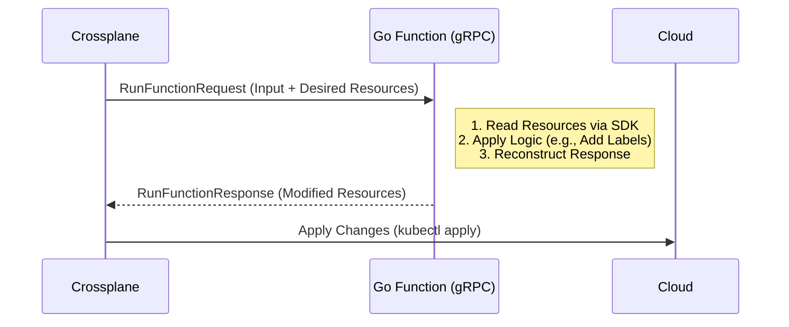

# Architecture: Go Composition Functions

## Overview
As part of **Phase 2 (Modern Data Engineering)**, Vellum is moving away from simple YAML-based `patch-and-transform` logic towards **Go-based Composition Functions**.

This document explains the architecture and code pattern for `functions/function-starter-go`.

## High-Level Architecture

Crossplane manages infrastructure using a **Composition Pipeline**. This pipeline is a series of steps.

1.  **Input**: Crossplane sends the "Desired State" (what you wrote in YAML) and the "Observed State" (what is running in the cloud) to the Function.
2.  **Processing**: The Go Function runs your custom logic (loops, conditionals, API calls).
3.  **Output**: The Function returns the modified "Desired State" back to Crossplane.



## Code Walkthrough

The code in `functions/function-starter-go/main.go` follows a standard pattern mandated by the `function-sdk-go`.

### 1. The Entrypoint (`main`)
This sets up a gRPC server that listens for incoming calls from Crossplane.
```go
func main() {
    // Starts the gRPC server on port 9443
    if err := function.Serve(&Function{}); err != nil {
        panic(err)
    }
}
```

### 2. The Loop (RunFunction)
This is where the magic happens. Every time Crossplane reconciles your infrastructure, it calls this function.

**Step A: Read the Input**
We use `request.GetDesiredComposedResources` to get a Map of all the resources (Deployment, Service, etc.) that Crossplane plans to create.
```go
desired, err := request.GetDesiredComposedResources(req)
```

**Step B: Apply Logic (Mutation)**
We allow standard Go loops and logic. In our starter, we simply tag everything.
```go
for name, dr := range desired {
    // Read existing labels
    labels := dr.Resource.GetLabels()
    
    // Mutate logic: Inject our signature mark
    labels["vellum.io/managed-by"] = "crossplane-go"
    
    // Write back to the resource object
    dr.Resource.SetLabels(labels)
}
```

**Step C: Write the Output**
Crossplane only knows about changes if we explicitly modify the Response object.
```go
response.SetDesiredComposedResources(rsp, desired)
```

## Why Go?
| Feature | YAML (Patch & Transform) | Go Function |
| :--- | :--- | :--- |
| **Loops** | ❌ Impossible | ✅ `for range` |
| **Conditionals** | ⚠️ Very limited | ✅ `if/else` |
| **External APIs** | ❌ No | ✅ Can call AWS/Cloud APIs |
| **Testing** | ❌ "Apply and pray" | ✅ `go test` Unit Tests |

## Testing Strategy
We strictly unit test this logic using `main_test.go`. Instead of needing a real Kubernetes cluster, we mock `RunFunctionRequest` inputs and assert that the output JSON matches our expectations. This allows us to verify logic in milliseconds rather than minutes.
