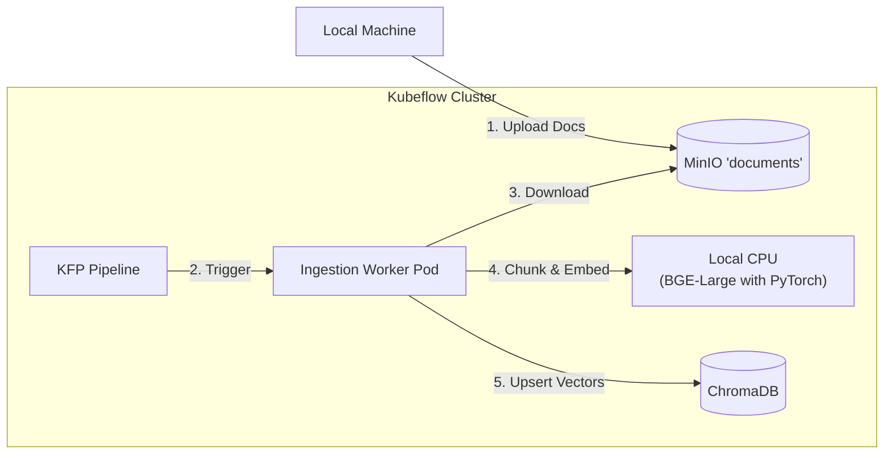

# Ingestion Pipeline Architecture

This document describes the architecture of the Vellum Document Ingestion Pipeline, implemented as part of **Phase 2: Modern Data Engineering**.

## Overview
The ingestion pipeline is responsible for processing raw documents (PDFs, TXT, MD) into vector embeddings suitable for Retrieval Augmented Generation (RAG). It is implemented as a **Kubeflow Pipeline (KFP)** running on the internal Kubernetes cluster.

## Architecture



## Components

### 1. Data Source: MinIO
*   **Service**: `minio-service.kubeflow.svc` (Port 9000).
*   **Bucket**: `documents`
*   **Content**: Raw files uploaded via `scripts/upload_to_minio.py` or other means.

### 2. Pipeline Execution: KFP
*   **Definition**: `pipelines/ingestion/pipeline.py` (KFP v2 SDK).
*   **Image**: `vellum-ingest:local` (Custom Docker image).
*   **Process**:
    *   **Container**: Runs `pipelines/ingestion/scripts/run_ingestion.py`.
    *   **Dependencies**: Includes `torch`, `llama-index`, `chromadb`, `boto3`. Isolated from the main backend to keep image sizes manageable.

### 3. Processing Logic
1.  **Download**: Fetches all objects from the specified MinIO bucket/prefix.
2.  **Loading**: Uses `llama_index.SimpleDirectoryReader` to parse files.
3.  **Chunking**: Uses `SemanticSplitterNodeParser` to intelligently split text based on semantic similarity.
4.  **Embedding**: Uses `HuggingFaceEmbedding` (Model: `BAAI/bge-large-en-v1.5`) running locally on CPU.
5.  **Indexing**: Pushes vectors to ChromaDB.

### 4. Vector Store: ChromaDB
*   **Service**: `chroma-service.kubeflow.svc` (Port 8000).
*   **Collection**: `kbase_docs`
*   **Persistence**: Backed by a Persistent Volume in the cluster.

## Operational Guide

### Triggering a Run
```bash
# Submit a new run from local CLI
uv run pipelines/ingestion/submit_run.py
```

### Monitoring
*   **KFP UI**: http://localhost:3000 (Via `scripts/start-kfp-ui.sh`).
*   **Logs**: `kubectl logs -n kubeflow <pod-name> -f`

### Verification
Run the verification script to check document counts in ChromaDB:
```bash
uv run scripts/verify_chroma.py
```
