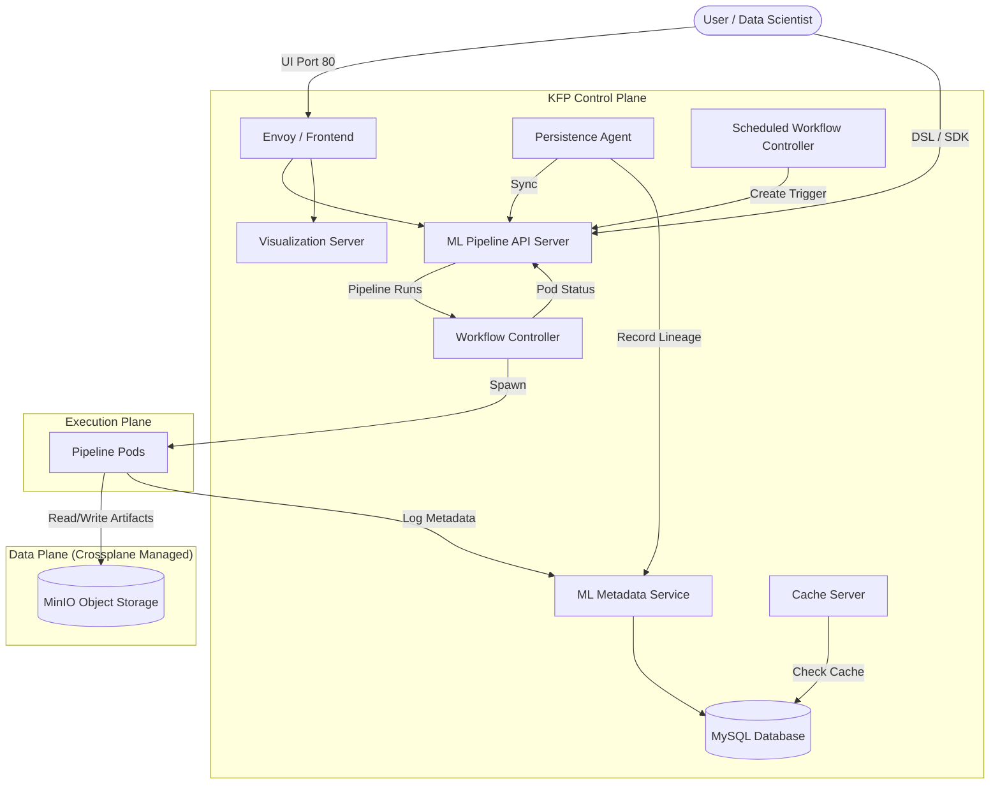

# Kubeflow Pipelines (KFP) Components Architecture

This document details the components of the Kubeflow Pipelines (KFP) system deployed in the Vellum platform, their roles, and how they interact.

## High-Level Architecture

KFP consists of a set of microservices that manage the lifecycle of ML workflows, including scheduling, execution, metadata tracking, and artifact storage. It runs on Kubernetes and relies on external object storage (MinIO) and a relational database (MySQL).

## Component Descriptions

### Core Services

#### 1. ML Pipeline API Server (`ml-pipeline`)
*   **Image**: `gcr.io/ml-pipeline/api-server:2.2.0`
*   **Port**: 8888 (HTTP), 8887 (gRPC)
*   **Role**: The central orchestration service. It exposes APIs to upload pipelines, start runs, list experiments, and get run status.
*   **Key Responsibilities**:
    *   **Pipeline Management**: Stores pipeline YAML/packages in MinIO and metadata in MySQL.
    *   **Run Orchestration**: Converts KFP Run requests into Argo `Workflow` Custom Resources (CRDs).
    *   **Proxying**: Proxies requests to the Visualization Server and ML Metadata.
*   **Dependencies**: MySQL (`mlpipeline` DB), MinIO (`mlpipeline` bucket).

#### 2. Persistence Agent (`ml-pipeline-persistenceagent`)
*   **Image**: `gcr.io/ml-pipeline/persistenceagent:2.2.0`
*   **Role**: A background controller that ensures data consistency between the Kubernetes execution state (Argo Workflows) and the ML Metadata store.
*   **Workflow**:
    1.  Watches Kubernetes `Workflow` resources for updates.
    2.  When a workflow step completes, it parsing the execution entries.
    3.  Records inputs, outputs, and lineage to the ML Metadata (MLMD) service.
*   **Why it matters**: Without this agent, the KFP UI "Lineage" graphs would be empty, even if the pods ran successfully.

#### 3. ML Metadata (MLMD)
*   **Components**: `metadata-grpc` (Server), `metadata-writer` (Sidecar/Job), `metadata-envoy` (Proxy).
*   **Role**: A standalone service for tracking the lineage of Machine Learning artifacts.
*   **Data Model**:
    *   **Context**: Grouping of executions (e.g., a Pipeline Run).
    *   **Execution**: A single step run (e.g., "Train Model").
    *   **Artifact**: Files produced or consumed (e.g., "dataset.csv", "model.onnx").
*   **Storage**: Persists strictly to MySQL (`metadb`).

#### 4. Workflow Controller (`workflow-controller`)
*   **Role**: The [Argo Workflows](https://argoproj.github.io/workflows/) operator.
*   **Responsibility**:
    *   Watches `Kind: Workflow` resources created by the API Server.
    *   Schedules actual Kubernetes Pods for each step in the DAG (Directed Acyclic Graph).
    *   Handles sidecars for artifact passing (Wait/Init containers).

### User Interface

#### 5. Frontend (`ml-pipeline-ui`)
*   **Image**: `ghcr.io/deploykf/kubeflow-pipelines/frontend:2.0.5`
*   **Port**: Service exposes port 80 (internally maps to 3000).
*   **Features**:
    *   **Pipelines Dashboard**: Upload and version pipelines.
    *   **Experiments & Runs**: Trigger and monitor executions.
    *   **Visualizations**: View confusion matrices, ROC curves, and HTML outputs.
*   **Integration**: It is a stateless React application that communicates solely with the `ml-pipeline` API Server.

### Infrastructure & Integration

#### Dependency Management (Crossplane)
In the Vellum platform, the stateful dependencies (MySQL, MinIO) are **not** embedded inside the KFP deployment. They are managed externally via **Crossplane** to ensure production-grade lifecycle management.

*   **MySQL**:
    *   **Resource**: `Release/mysql` (Bitnami Chart).
    *   **Integration**: KFP receives connection details via `mysql-secret`.
    *   **Databases**: `mlpipeline` (API), `metadb` (MLMD), `cachedb` (Caching).
*   **MinIO**:
    *   **Resource**: `Release/minio` (MinIO Official/Bitnami Chart).
    *   **Integration**: KFP uses `mlpipeline-minio-artifact` secret (Access/Secret Keys).
    *   **Buckets**: `mlpipeline` (Stores pipeline YAMLs and run artifacts).

#### Networking & Security
*   **Internal Communication**: Services communicate via unencrypted HTTP/gRPC within the `kubeflow` namespace.
*   **Service Discovery Strategy**:
    *   **Challenge**: Crossplane manages external resources (MinIO/MySQL) with dynamic Pod names, while KFP expects fixed service DNS names (`minio-service`, `mysql`).
    *   **Solution**: We deploy standard Kubernetes Services (`minio-service`, `mysql`) but **patched their selectors** to point to Crossplane's stable labels (`app=minio`, `app.kubernetes.io/name=mysql`). This acts as a robust stable interface for movable infrastructure.
*   **Service Accounts**:
    *   `ml-pipeline`: Has RBAC to manage Workflows and Pods.
    *   `pipeline-runner`: The Service Account used by the *actual pipeline pods* to access MinIO secrets and report status.

## Data Flow Example: "Hello World" Run

1.  **Submission**: User submits `hello_world.py` via SDK.
    *   The Python SDK compiles it to a YAML specification.
    *   SDK uploads YAML to `ml-pipeline` API.
2.  **Storage**:
    *   API Server saves YAML to MinIO: `minio://mlpipeline/pipelines/...`
    *   API Server saves Pipeline ID/Name to MySQL: `mlpipeline.pipelines` table.
3.  **Trigger**: User clicks "Start Run".
    *   API Server creates a `Workflow` CRD in Kubernetes.
4.  **Execution**:
    *   `workflow-controller` sees the CRD and spawns `Pod-A`.
    *   `Pod-A` runs, produces `output.txt`.
    *   Argo sidecars upload `output.txt` to MinIO.
5.  **Recording**:
    *   `ml-pipeline-persistenceagent` detects `Pod-A` completion.
    *   It calls `metadata-grpc` to record: "Execution X produced Artifact Y at MinIO Path Z".
6.  **Visualization**:
    *   User views "Run Detail" in UI.
    *   UI queries API Server, which compiles data from MySQL (Status) and MLMD (Lineage) to render the graph.
