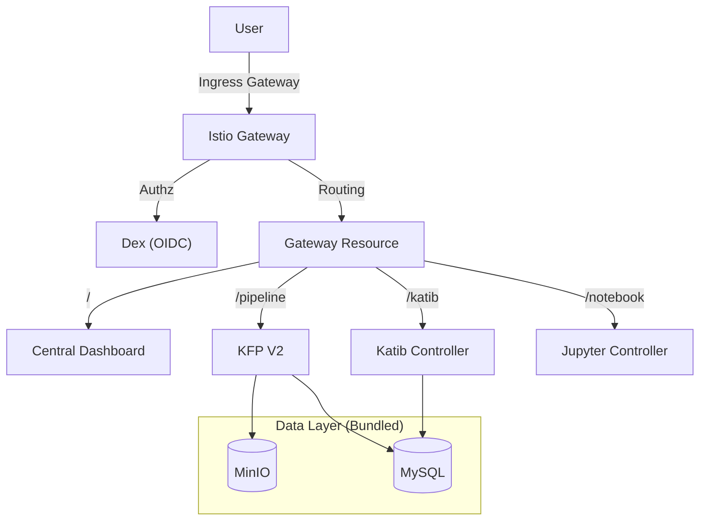

# Kubeflow Platform Upgrade Plan

## Objective
Transition from "Standalone" components (KFP, Katib) to a fully integrated **Kubeflow Platform** with:
-   **Istio Service Mesh**: For traffic management and security.
-   **Central Dashboard**: Single pane of glass for all tools.
-   **Multi-Tenancy**: Namespace isolation (Profiles).
-   **Auth**: OIDC (Dex) for user login.

## Motivation
As a DevOps/SRE, operating standalone components is fragile. The Integrated Platform provides a production-grade architecture with unified access.

## Strategy Options

## Strategy Options

### Option A: The "Patch" Approach (Hard Mode)
Install Istio and Dashboard on top of existing KFP/Katib.
-   **Pros**: Preserves current data (MinIO/MySQL).
-   **Cons**: Extremely difficult to wire. Standalone KFP doesn't natively speak Istio's Auth protocols (userid header). Katib UI expects specific prefixes.
-   **Risk**: High probability of "Frankenstein" configuration issues.

### Option B: The "Clean Build" Approach (Recommended)
Use the official `kubeflow/manifests` (v1.8 or v1.9) to deploy the coherent stack.
-   **Pros**:
    -   Guaranteed compatibility between Dashboard, KFP, and Katib.
    -   Includes Istio correctly configured with Gateway/VirtualServices.
    -   Standard "Day 2" operations using Kustomize.
-   **Cons**: Requires wiping the current `kubeflow` namespace.
-   **Legacy Components**: We will **retire** our custom Bitnami MinIO/MySQL and use the platform-bundled statefulsets. This significantly reduces our maintenance burden (no separate Helm charts).

## Proposed Architecture (Option B)

## Execution Steps
1.  **Cleanup**: `kubectl delete namespace kubeflow`.
2.  **Install**:
    -   Apply `kubeflow/manifests` (v1.9).
    -   Wait for all pods (Istio, CertManager, KFP, Katib, Auth).
3.  **Access**: Port-forward the Istio Gateway (`localhost:8080`).
4.  **Verify**: Log in (default: `user@example.com`) and see the Central Dashboard.

## Decision
Proceeding with **Option B**. This moves us from "Developer Playground" to "SRE Platform" architecture.
