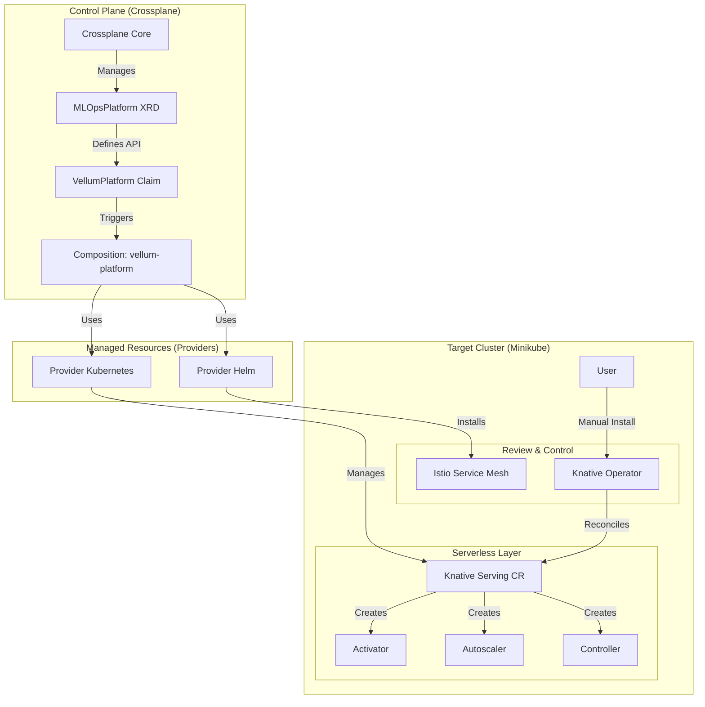

# Phase 1: Infrastructure Walkthrough (Crossplane + Kubeflow Foundation)

This document details the successful setup of the **Vellum MLOps Platform** infrastructure on Minikube. We used **Crossplane** to manage the underlying platform components, treating infrastructure as code.

## Architecture Guidelines

We adopted the **Kubeflow Native** architecture, but orchestrated via Crossplane to maintain an "Infrastructure as Data" approach.

### Component Diagram

## Implementation Steps

### 1. Crossplane Core Bootstrap
We started by verifying the Minikube environment (10 CPUs, 24GB RAM).
- **Installed Crossplane**: Used the stable Helm chart.
- **Providers**: Installed `provider-kubernetes` (v0.11.1) and `provider-helm` (v0.19.0).
- **Configuration**:
    - applied a `ProviderConfig` using `source: InjectedIdentity`.
    - **Crucial Fix**: We had to restart the provider pods to force them to pick up the `InjectedIdentity` configuration after an initial misconfiguration with `source: None`.
    - **RBAC**: Created `ClusterRoleBinding`s to grant `cluster-admin` to the provider ServiceAccounts, allowing them to create Namespaces, Deployments, etc.

### 2. Platform Definition (XRD & Composition)
We defined the API for our platform using Crossplane's Composite Resource Definitions (XRDs).
- **XRD**: `xvellumplatforms.infrastructure.vellum.io` defines the schema (e.g., version).
- **Composition**: Maps the high-level `VellumPlatform` claim to low-level resources:
    - **Istio Base** (Helm Release)
    - **Istio Daemon** (Helm Release)
    - **Knative Serving** (Kubernetes Object - Custom Resource)

### 3. Service Mesh (Istio)
Istio provides the networking layer required by Kubeflow and Knative.
- Installed into `istio-system`.
- Validated via `kubectl get pods -n istio-system` matches.

### 4. Serverless (Knative)
Knative enables simple scaling and "scale-to-zero" for our future KServe inference services.
- **Challenge**: The Knative Operator Helm chart repository was difficult to locate via standard `helm repo add`.
- **Solution**: We configured the Crossplane Helm Provider to use the official **GitHub Pages Repository** with the correct version tag.
    - **Repository**: `https://knative.github.io/operator`
    - **Chart**: `knative-operator`
    - **Version**: `v1.20.0`
- **Networking**: Configured Knative to use `net-istio` and the local cluster gateway.

## Verification

To ensure the platform is healthy, we check:
1.  **Crossplane Providers**: Must be `Healthy`.
2.  **Managed Resources**: All `Release` and `Object` resources must be `SYNCED: True`.
3.  **Pod Status**: Control plane pods for Istio and Knative must be `Running`.

### Automated Verification
Run the verification script:
`bash ./scripts/verify-phase1.sh`
