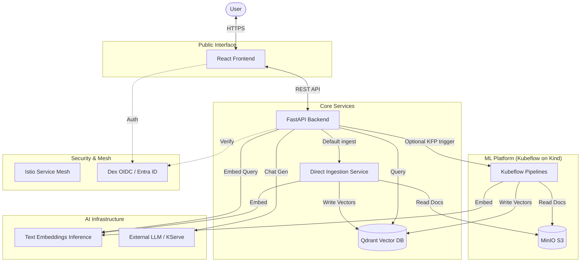

# Architecture & Conventions

Vellum is built on a **decoupled microservices architecture** optimized for enterprise RAG workloads.

## Phase 1 Runtime Note

The current active local platform is no longer Minikube-based. Phase 1 is now considered complete on **Kind**, using the existing Kubeflow-era stack with a **slim default manifest set** and **direct ingestion as the operational default**.

What stays in Phase 1:
- Istio ingress and mesh policy
- Dex + oauth2-proxy
- Kubeflow Pipelines
- KServe + Knative for the local Qwen model
- MinIO for document storage
- TEI, Qdrant, backend, and frontend

Operational default in completed Phase 1:
- `INGESTION_MODE=direct` for day-to-day ingestion on Kind
- persisted ingestion status in MinIO with resumable batches and clean-slate rebuilds
- KFP retained as an optional debug path rather than the primary local contract

What is removed from the default local boot in Phase 1:
- Katib
- Jupyter web app and notebook controller
- TensorBoard controller and web app
- PVC Viewer
- Volumes web app
- Trainer

The `deployment/manifests` submodule should track **Kubeflow manifests v1.11.0**. The local cluster bootstrap uses `kind-config.yaml`, `deployment/kustomization.yaml`, and `scripts/setup-kind.sh`.

## 🏗️ System Overview

The following diagram illustrates the high-level flow from user interaction to document ingestion and AI inference.



### 🧩 Core Components

#### 1. Frontend (React 19)
- **Runtime**: Node 24.13.0 (Krypton LTS)
- **Build Tool**: Vite 7 + pnpm (Corepack enabled)
- **UI Library**: shadcn/ui + Radix UI Primitives (Accessible components).
- **Styling**: Tailwind CSS 4 with native OKLCH theme tokens.
- **State Management**: React Query (Server state) + React Context (UI state).
- **Auth**: MSAL (`@azure/msal-react`) integrated with Entra ID.
- **Responsibility**: Provides the chat interface, session management, and admin controls for ingestion.

#### 2. Backend (FastAPI)
- **Toolchain**: Python 3.12 managed by `uv`.
- **Identity**: Lightweight "Gatekeeper" service. It does **not** include heavy ML libraries like `torch` or `transformers`.
- **Protocol**: `httpx` for async internal communication.
- **Responsibility**: Validates OIDC tokens, manages chat history in memory/DB, and executes RAG retrieval queries against Qdrant.

#### 3. Distributed Ingestion
- **Operational Default**: The backend's direct-ingestion service reads source objects from MinIO, embeds through TEI, writes to Qdrant, and persists progress/status in MinIO so batches can resume safely.
- **Optional Kubeflow Path**: The KFP v2 pipeline remains available for explicit Kubeflow debugging and historical continuity during the broader migration plan.
- **Process**:
    - **Streaming ETL**: Efficiently streams large documents from MinIO.
    - **Chunking**: Splits documents through the shared ingestion logic.
    - **Remote Vectorization**: Calls the TEI service for embedding generation.
    - **Deduping/Resume**: Skips unchanged files by signature, replaces changed files, and supports `cleanup=true` for a clean-slate rebuild.

#### 4. Vector Store (Qdrant)
- **Type**: Distributed Vector Database (Rust-based).
- **Responsibility**: Stores document embeddings and metadata; performs fast similarity searches (MMR supported).

#### 5. AI Infrastructure
- **Embeddings (TEI)**: Dedicated `text-embeddings-inference` service providing OpenAI-compatible endpoints for vectorization.
- **Inference**: Pluggable support for OpenAI, Google Gemini, AWS Bedrock, or self-hosted models via **KServe** in the retained Phase 1 stack.

## Local Infrastructure Conventions

- **Cluster Runtime**: `kind` is the default local runtime in the active plan.
- **Image Flow**: locally built images are loaded directly into the Kind cluster with `kind load docker-image`.
- **Kubeconfig**: the bootstrap merges the cluster into `~/.kube/config`, normalizes the context name to `vellum`, and leaves the repo on the standard single-file kubectl workflow.
- **Deployment Default**: `deployment/kustomization.yaml` is the slim Phase 1 overlay. `deployment/kustomization-full.yaml` preserves the previous full-stack manifest selection for reference.
- **Secrets**: app env vars are synchronized from `.env` into the `vellum-env` secret via `./scripts/sync-env-secret.sh` instead of Kustomize secret generation.

---

## 🛠️ Code Conventions

### Backend (Python)
- **Type Safety**: All functions must have complete type hints.
- **Validation**: Use Pydantic v2 for all API schemas.
- **Logging**: Structured logging via `structlog`. Use `logger.info("event_name", **metadata)` format.
- **Async**: Everything should be async-first where supported (FastAPI, Qdrant, httpx).

### Frontend (TypeScript)
- **Framework**: Functional components with Hooks.
- **State**: React Query for server state; Context/Zustand for UI state.
- **Styling**: Tailwind CSS 4 with OKLCH color support.
- **Logging**: LogLayer wrapper for consistent console output.

---

## 🗺️ Project Structure

```text
Vellum/
├── backend/            # FastAPI API & RAG Retrieval
├── frontend/           # React App
├── kubeflow/           # KFP Pipeline definitions & ML logic
├── deployment/         # Kubernetes manifests + Kubeflow submodule
│   └── manifests/      # Kubeflow manifests v1.11.0 submodule
├── docs/               # Technical documentation hub
└── scripts/            # Infrastructure automation
```

---

## ⚖️ Key Architectural Decisions

- **[ADR 001] Decoupled Ingestion**: Separating heavy ingestion from the API ensures the chatbot remains responsive even during large data imports.
- **[ADR 002] Qdrant vs ChromaDB**: Chose Qdrant for its Rust-based performance, namespace support, and built-in dashboard.
- **[ADR 003] TEI for Embeddings**: Offloading vectorization to a dedicated service reduces the backend CPU footprint and centralizes model management.
