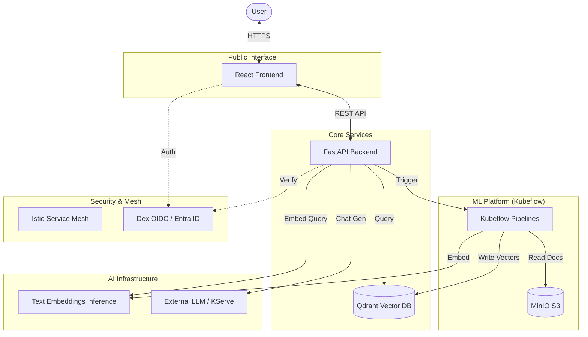

# Architecture & Conventions

Vellum is built on a **Decoupled Microservices Architecture** optimized for enterprise RAG (Retrieval-Augmented Generation) workloads.

## 🏗️ System Overview

The following diagram illustrates the high-level flow from user interaction to document ingestion and AI inference.



### 🧩 Core Components

#### 1. Frontend (React 19)
- **Runtime**: Node 24.13.0 (Krypton LTS)
- **Build Tool**: Vite 7 + pnpm (Corepack enabled)
- **Auth**: MSAL (`@azure/msal-react`) integrated with Entra ID.
- **Responsibility**: Provides the chat interface, session management, and admin controls for ingestion.

#### 2. Backend (FastAPI)
- **Toolchain**: Python 3.12 managed by `uv`.
- **Identity**: Lightweight "Gatekeeper" service. It does **not** include heavy ML libraries like `torch` or `transformers`.
- **Protocol**: `httpx` for async internal communication.
- **Responsibility**: Validates OIDC tokens, manages chat history in memory/DB, and executes RAG retrieval queries against Qdrant.

#### 3. Distributed Ingestion (Kubeflow Pipelines)
- **Orchestration**: KFP v2 SDK.
- **Environment**: Isolated Docker containers with full ML stack (`llama-index`, `pypdf`, `torch` if needed).
- **Process**:
    - **Streaming ETL**: Efficiently streams large documents from MinIO.
    - **Semantic Chunking**: Intelligent splitting based on content similarity.
    - **Remote Vectorization**: Calls the TEI service for high-throughput embedding generation.

#### 4. Vector Store (Qdrant)
- **Type**: Distributed Vector Database (Rust-based).
- **Responsibility**: Stores document embeddings and metadata; performs fast similarity searches (MMR supported).

#### 5. AI Infrastructure
- **Embeddings (TEI)**: Dedicated `text-embeddings-inference` service providing OpenAI-compatible endpoints for vectorization.
- **Inference**: Pluggable support for OpenAI, Google Gemini, or self-hosted models via **KServe**.

---

## 🛠️ Code Conventions

### Backend (Python)
- **Type Safety**: All functions must have complete type hints.
- **Validation**: Use Pydantic v2 for all API schemas.
- **Logging**: Structured logging via `structlog`. Use `logger.info("event_name", **metadata)` format.
- **Async**: Everything should be async-first where supported (FastAPI, Qdrant, httpx).

### Frontend (TypeScript)
- **Framework**: Functional components with Hooks.
- **State**: React Query for server state; Context/Zustand for UI state.
- **Styling**: Tailwind CSS 4 with OKLCH color support.
- **Logging**: LogLayer wrapper for consistent console output.

---

## 🗺️ Project Structure

```text
Vellum/
├── backend/            # FastAPI API & RAG Retrieval
├── frontend/           # React App
├── kubeflow/           # KFP Pipeline definitions & ML logic
├── deployment/         # Kubernetes manifests (submodule)
├── docs/               # Technical documentation hub
└── scripts/            # Infrastructure automation
```

---

## ⚖️ Key Architectural Decisions

- **[ADR 001] Decoupled Ingestion**: Separating heavy ingestion from the API ensures the chatbot remains responsive even during large data imports.
- **[ADR 002] Qdrant vs ChromaDB**: Chose Qdrant for its Rust-based performance, namespace support, and built-in dashboard.
- **[ADR 003] TEI for Embeddings**: Offloading vectorization to a dedicated service reduces the backend CPU footprint and centralizes model management.
