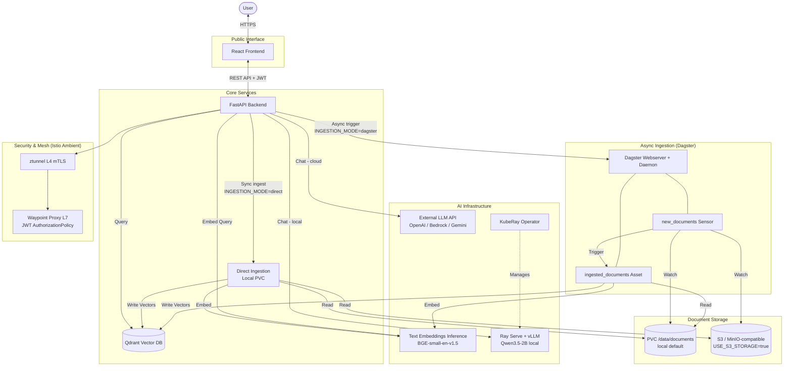

# Architecture & Conventions

Vellum is built on a **decoupled microservices architecture** optimized for enterprise RAG workloads.

> **Phase 4 Status:** Kubeflow stack (KFP, Dex, MinIO, Cert-Manager, oauth2-proxy) fully removed.
> Runtime is Kind with Istio **Ambient** mesh, Dagster for async ingestion, Ray Serve for local LLM inference.

## 🏗️ System Overview



### 🧩 Core Components

#### 1. Frontend (React 19)
- **Runtime**: Node 24.13.0 (Krypton LTS)
- **Build Tool**: Vite 7 + pnpm (Corepack enabled)
- **UI Library**: shadcn/ui + Radix UI Primitives.
- **Styling**: Tailwind CSS 4 with native OKLCH theme tokens.
- **State Management**: React Query (Server state) + React Context (UI state).
- **Auth**: MSAL (`@azure/msal-react`) integrated with Entra ID.
    - **Entra ID Flow**: Authorization Code flow with Proof Key for Code Exchange (PKCE). Supported natively by MSAL `@azure/msal-react`.

## 🚢 Infrastructure Translation (Kind CI Parity)
Kind is our official local reference architecture. Rather than relying on docker-compose for local testing and K8s for cloud, Vellum runs full upstream Kubernetes locally via Kind.

This ensures that development, CI testing, and production behavior are **identical**:
- **Same Service Mesh**: Istio Ambient mode works on Kind exactly as it does on EKS/GKE.
- **Same Storage Lifecycle**: Local path provisioners use the same `ReadWriteOnce` constraints as standard cloud block storage.
- **Same Helm/Kustomize Stack**: KubeRay Operator, Dagster, and Qdrant Helm charts evaluate identically.
The `./scripts/run-e2e-kind.sh` flow guarantees that passing local tests translates directly to successful cloud deployments.

#### 2. Backend (FastAPI)
- **Language**: Python 3.12+, managed by `uv`.
- **Framework**: FastAPI with Pydantic v2 schemas.
- **Auth**: Entra ID JWT validation (single trust anchor). `kubeflow-userid` header bypass removed in Phase 4.
- **Ingestion modes**: `direct` (default — synchronous PVC scan) or `dagster` (async job trigger via GraphQL).
- **Storage**: `StorageService` abstraction — `LocalStorageService` (PVC) or `S3StorageService` (boto3). Toggle: `USE_S3_STORAGE`.

#### 3. Qdrant (Vector DB)
- Deployed via Helm into the `qdrant` namespace.
- Default collection: `vellum`, COSINE similarity, 384-dim (BGE-small).
- Accessed at `qdrant.qdrant.svc.cluster.local:6333`.

#### 4. Dagster (Ingestion Orchestration)
- Replaces Kubeflow Pipelines for async ingestion.
- Deployed via Helm into the `kubeflow-vellum` namespace to share PVC access.
- **User code deployment**: `dagster_vellum` module in `dagster/` directory.
- **Assets**: `ingested_documents` — reads storage → chunks → embeds via TEI → upserts to Qdrant.
- **Sensor**: `new_documents_sensor` — polls storage every 30 s and triggers asset on new files.
- **UI**: Port-forwarded to `http://localhost:3200` via `connect.sh`.

#### 5. TEI (Text Embeddings Inference)
- Hosted in `kubeflow-vellum` namespace as `embeddings-service`.
- Model: `BAAI/bge-small-en-v1.5` (384-dim, CPU-compatible, swappable per TEI model config).
- OpenAI-compatible `/v1/embeddings` endpoint.

#### 6. Ray Serve + vLLM (Local LLM)
- Managed by the KubeRay Operator in `vellum-ray` namespace.
- Wraps vLLM to serve Qwen3.5-2B with an OpenAI-compatible `/v1/chat/completions` endpoint.
- Activated by `ENABLE_LOCAL_LLM=true`.
- Ray cluster dashboard port-forwarded to `http://localhost:8265`.

#### 7. Document Storage
- **Local (default)**: PVC `documents-pvc` in `kubeflow-vellum` namespace, mounted at `/data/documents` in both the backend and Dagster worker pods.
- **Cloud**: Any S3-compatible store (`USE_S3_STORAGE=true`, configure `S3_BUCKET`, `S3_ENDPOINT`).

#### 8. Istio Ambient Mesh — *Phase 4 migration*
- Replaces sidecar mode (removed with the Kubeflow bundled Istio).
- `ztunnel` DaemonSet handles L4 mTLS between all pods automatically.
- **Waypoint proxy** (`vellum-waypoint` Gateway) handles L7 JWT `RequestAuthentication` and `AuthorizationPolicy` for the `kubeflow-vellum` namespace.
- Namespace enrolled: `kubeflow-vellum` labelled `istio.io/dataplane-mode: ambient`.

---

## 🔒 Security Model

```
User Browser
    │ HTTPS (JWT in Authorization header)
    ▼
Istio Ingress Gateway  ──▶  ztunnel (L4 mTLS)
    │                            │
    ▼                            ▼
Waypoint Proxy (L7)      Dagster / Qdrant / TEI
    │  RequestAuthentication     (transparently mTLS-secured)
    │  JWT verified (Entra ID)
    ▼
FastAPI Backend (secondary JWT check — defense-in-depth)
    │
    ▼
Business Logic / Qdrant / Storage
```

- **Single identity provider**: Microsoft Entra ID (Azure AD). No Dex, no oauth2-proxy.
- **BYPASS_AUTH=true**: local dev only shortcut; never set in staging/prod.
- The `kubeflow-userid` header fallback was a Dex-era bypass and was removed in Phase 4.

---

## 🗃️ Tech Stack Summary

| Layer | Technology | Notes |
|---|---|---|
| Frontend | React 19 + Vite | pnpm managed |
| Backend | FastAPI (Python 3.12) | uv managed |
| Auth | Entra ID JWT | Istio + backend dual-layer |
| Service Mesh | **Istio Ambient** | ztunnel L4 + waypoint L7 |
| Vector DB | Qdrant (Helm) | cosine, 384-dim |
| Ingestion (sync) | Direct IngestionService | reads local PVC path |
| Ingestion (async) | **Dagster** (Helm) | replaces KFP |
| Document Storage | PVC / S3 | toggled by USE_S3_STORAGE |
| Embeddings | TEI (BGE-small) | OpenAI-compatible |
| Local LLM | Ray Serve + vLLM | Qwen3.5-2B |
| K8s Runtime | **Kind** | local dev |
| Container Registry | Local kind registry | |

---

## 📋 Architecture Decision Records

| ADR | Decision | Status |
|---|---|---|
| ADR-001 | Kind over Minikube for local dev | ✅ Accepted (Phase 1) |
| ADR-002 | Direct ingestion as default over KFP | ✅ Accepted (Phase 1) |
| ADR-003 | Ray Serve + vLLM replacing KServe | ✅ Accepted (Phase 3) |
| ADR-004 | Dagster replaces KFP for pipeline ingestion | ✅ Accepted (Phase 4) |
| ADR-005 | Istio Ambient replaces sidecar mode | ✅ Accepted (Phase 4) |
| ADR-006 | PVC + StorageService replaces MinIO | ✅ Accepted (Phase 4) |

See `docs/designs/` for individual ADR documents.
