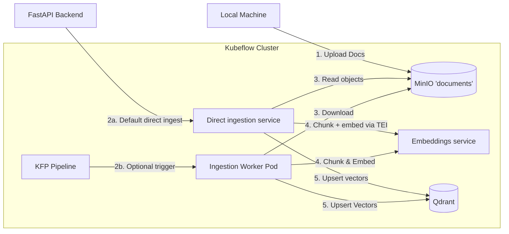

# Ingestion Pipeline Architecture

This document describes the current completed Phase 1 ingestion architecture. The operational default is backend-driven direct ingestion on Kind; the original KFP flow remains available as an optional debug path during the broader infrastructure migration.

## Overview
The ingestion path is responsible for processing raw documents into vector embeddings suitable for Retrieval Augmented Generation (RAG). In completed Phase 1, the backend normally reads from MinIO, embeds through TEI, writes to Qdrant, and persists progress in MinIO so runs can resume across bounded batches. The KFP path still exists when `INGESTION_MODE=kfp` is enabled for focused Kubeflow debugging.

## Architecture



## Components

### 1. Data Source: MinIO
*   **Service**: `minio-service.kubeflow.svc` (Port 9000).
*   **Bucket**: `documents`
*   **Content**: Raw files uploaded via `scripts/upload_to_minio.py` or other means.

### 2. Pipeline Execution: KFP
*   **Definition**: `pipelines/ingestion/pipeline.py` (KFP v2 SDK).
*   **Image**: `vellum-ingest:local` (Custom Docker image).
*   **Process**:
    *   **Container**: Runs `pipelines/ingestion/scripts/run_ingestion.py`.
    *   **Dependencies**: Includes `torch`, `llama-index`, `chromadb`, `boto3`. Isolated from the main backend to keep image sizes manageable.

### 3. Direct Ingestion Execution
*   **Entry Point**: `POST /api/v1/admin/upload-and-ingest`
*   **Status**: `GET /api/v1/admin/ingestion-status`
*   **Behavior**:
    *   Persists progress in MinIO.
    *   Skips unchanged files by stable source signature.
    *   Replaces prior chunks for changed files.
    *   Supports `cleanup=true` for full collection rebuilds.
    *   Rejects overlapping runs while a prior run is still `running`.

### 4. Processing Logic
1.  **Download**: Fetches all objects from the specified MinIO bucket/prefix.
2.  **Loading**: Uses `llama_index.SimpleDirectoryReader` to parse files.
3.  **Chunking**: Uses the shared ingestion logic to split documents into chunks.
4.  **Embedding**: Uses the TEI service through its OpenAI-compatible embeddings API.
5.  **Indexing**: Pushes vectors to Qdrant via `QdrantVectorStore`.

### 5. Vector Store: Qdrant
*   **Service**: `qdrant.qdrant.svc.cluster.local` (Port 6333).
*   **Collection**: `vellum`
*   **Persistence**: Backed by a Persistent Volume in the `qdrant` namespace.

## Operational Guide

### Triggering a Run
```bash
# Default Phase 1 path
curl -X POST "http://localhost:8006/api/v1/admin/upload-and-ingest?cleanup=true&reset_progress=true" \
    -H "kubeflow-userid: vellum@example.com"

# Optional KFP debug path
INGESTION_MODE=kfp uv run pipelines/ingestion/submit_run.py
```

### Monitoring
*   **Direct Status API**: `http://localhost:8006/api/v1/admin/ingestion-status`
*   **KFP UI**: `http://localhost:8086/_/pipeline/#/runs` when `INGESTION_MODE=kfp` is in use.
*   **Logs**: `kubectl logs -n kubeflow <pod-name> -f`

### Verification
Run the verification script to check retrieval quality:
```bash
uv run scripts/verify_retrieval.py
```
