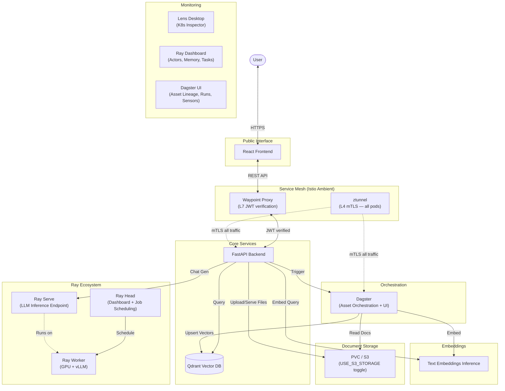

# Infrastructure Migration from Minikube to Kind + Ray-Native Architecture

## Objective

This plan covers four interconnected migrations:

1. **Cluster Runtime**: Minikube → **Kind** (local development, validation, and CI parity gatekeeper).
2. **ML Infrastructure**: Full Kubeflow Stack → **KubeRay + Dagster** (modular, industry-standard).
3. **Service Mesh**: Istio Sidecar Mode → **Istio Ambient Mode** (~3 GB RAM savings, production-parity with EKS/GKE).
4. **Storage**: MinIO → **PVC for local dev** / **S3 for cloud** (zero-infra document storage with `USE_S3_STORAGE` toggle).

### Design Philosophy: Kind Only

**Kind is the reference architecture.** All design decisions target compatibility with full upstream Kubernetes (Kind, EKS, GKE). Local development and CI should exercise the same Kind-based workflow so there is one runtime contract to maintain.

This means: Istio Ambient, standard Kubernetes Ingress, Helm charts, and manifests that stay valid on full upstream Kubernetes. The target is **cloud-portable infrastructure** that deploys identically to EKS/GKE.

### Why All at Once?

The cluster runtime swap (Phase 1) is the ideal time to rethink the stack. Rather than migrate the full 13 GB Kubeflow monolith into another local-only abstraction, we progressively slim it down and replace heavyweight components with targeted alternatives. By Phase 4, the stack drops from ~13 GB to ~8.1 GB with better modularity, production parity, and a local-first developer experience.

---

## Current State Analysis

### Resource Footprint (Minikube, Today)

| Component | Namespace | RAM | Active Use? |
|-----------|-----------|-----|-------------|
| **Istio** (control plane + sidecars) | `istio-system` | ~4 GB | Auth gateway, mTLS |
| **KFP** (API, Argo, MLMD, MySQL, MinIO) | `kubeflow` | ~4 GB | Ingestion pipelines |
| **KServe + Knative** | `kubeflow-vellum` | ~1 GB | Local LLM serving (Qwen 3.5) |
| **Katib** | `kubeflow` | ~0.5 GB | Tuning sessions only |
| **Central Dashboard** | `kubeflow` | ~0.3 GB | KFP/Katib UI |
| **Dex + OAuth2 Proxy** | `auth` | ~0.2 GB | Kubeflow internal auth |
| **Cert Manager** | `cert-manager` | ~0.2 GB | TLS lifecycle |
| **TEI** (embeddings) | `kubeflow-vellum` | ~2 GB | Always needed |
| **Qdrant** | `qdrant` | ~0.5 GB | Always needed |
| **Vellum Backend** | `kubeflow-vellum` | ~0.3 GB | Always needed |
| **Vellum Frontend** | `kubeflow-vellum` | ~0.1 GB | Always needed |
| Tensorboard, Jupyter, Trainer, Profiles | various | ~0.5 GB | **Not used** |
| **Total** | | **~13.6 GB** | |

### Target Architecture (After Phase 4)

| Component | Namespace | RAM | Notes |
|-----------|-----------|-----|-------|
| **K8s system** | `kube-system` | ~0.3 GB | Cluster runtime (Kind) |
| **Istio Ambient** (istiod + ztunnel + cni) | `istio-system` | ~0.7 GB | mTLS, AuthorizationPolicy — no sidecars |
| **Dagster** (webserver + daemon + PostgreSQL) | `dagster` | ~0.7 GB | Pipeline orchestration, asset lineage, UI |
| **KubeRay Operator** | `kuberay-system` | ~0.3 GB | Manages RayCluster CRDs |
| **Ray Cluster** (head + GPU worker) | `vellum-ray` | ~3 GB CPU + GPU VRAM | Ray Serve for LLM, Ray Dashboard |
| **TEI** (embeddings) | `vellum` | ~2 GB | Unchanged |
| **Qdrant** | `qdrant` | ~0.5 GB | Unchanged |
| **Vellum Backend** | `vellum` | ~0.3 GB | Unchanged |
| **Vellum Frontend** | `vellum` | ~0.1 GB | Unchanged |
| **Documents PVC** | `vellum` | 0 GB | Just a volume claim, no pod |
| **Waypoint Proxy** | `vellum` | ~0.1 GB | L7 JWT verification (only for vellum namespace) |
| **Total** | | **~8.0 GB** | **~5.6 GB savings** |

### Target Architecture Diagram



---

## Architectural Decisions & Tradeoffs

### Decision 1: KubeRay + Ray Serve replaces KServe + Knative + vLLM

**Why this is the right call:**
- vLLM has **first-class Ray integration**. Running `vllm.entrypoints.openai.api_server` inside a Ray Serve deployment gives you the same OpenAI-compatible API but with Ray's actor model for GPU management, auto-batching, and memory optimization.
- KServe + Knative adds ~1 GB of RAM and significant CRD complexity (InferenceService, Knative Serving, Activator, Queue-Proxy). Ray Serve is simpler: one RayService CRD.
- **Industry alignment**: In 2026, KubeRay + Ray Serve is the dominant pattern for ML serving at Uber, Spotify, Shopify, and Anyscale customers.
- Learning the **KubeRay Operator** teaches CRD lifecycle management, pod scheduling, and resource quotas — the same skills as managing any K8s operator.

**What you keep:** The OpenAI-compatible API endpoint stays identical. The backend's `llm_service.py` just points to a different URL.

### Decision 2: Dagster replaces KFP (NOT Airflow, NOT KFP Standalone)

**Why Dagster over KFP Standalone:**
- **Asset-centric paradigm**: Dagster thinks in "assets" (things that exist), not "tasks" (things that run). You define *what* your pipeline produces, Dagster figures out *how* and *when*. This is a fundamentally better abstraction for ML data pipelines.
- **Local-first development**: `dagster dev` runs the full pipeline locally — no K8s cluster needed to test. This aligns perfectly with the "spin up in seconds" goal.
- **Built-in UI (Dagster UI)**: Modern asset lineage graphs, run history, schedules, and sensors. Replaces KFP Dashboard with something better.
- **Built-in Sensors**: Can watch a directory or S3 bucket for new files and auto-trigger ingestion — something KFP requires external tooling for.
- **Lighter footprint**: Dagster (webserver + daemon + PostgreSQL) uses ~0.7 GB vs KFP standalone's ~2 GB (API + Argo + MySQL + MLMD).
- **2026 industry standard**: Dagster has become the go-to orchestrator for modern data and ML teams.
- **`dagster-ray` integration**: Native support for submitting Ray Jobs from Dagster pipelines.

**Why NOT Airflow:**
- Airflow is task-centric (DAGs), not asset-centric. No native lineage.
- Heavier operational burden (scheduler, webserver, workers, Celery/K8s executor).
- No local-first development story.

**Why NOT KFP Standalone:**
- Still requires Argo Workflows, MySQL, and MLMD — more infrastructure than Dagster.
- KFP's multi-user auth model adds complexity even in standalone mode.
- KFP SDK is less ergonomic than Dagster's Python-native definitions.

**The rewrite effort is small:**
The current KFP pipeline (`kubeflow/pipelines/ingestion/pipeline.py`) is a single `@dsl.component` that calls a Python script. In Dagster, this becomes a `@asset` or `@op` with the same underlying logic (`run_ingestion.py` is unchanged). Estimated rewrite: 1-2 hours.

**What changes from today:**
- Deploy Dagster via `dagster-helm` Helm chart.
- Create a `dagster/` project directory with Dagster definitions.
- Rewrite `kfp_service.py` → `dagster_service.py` (use Dagster GraphQL API).
- Remove KFP, Argo Workflows, MLMD, MySQL.

### Decision 3: PVC replaces MinIO for local dev, S3 for cloud (`USE_S3_STORAGE` toggle)

**Why drop MinIO:**
- MinIO is used in exactly 4 backend files: `admin.py` (upload), `files.py` (serve), `kfp_service.py` (pipeline params), `config.py` (settings).
- After the Dagster migration, KFP-related MinIO usage disappears entirely.
- What remains is simple: store source documents and serve them to the frontend.
- A PersistentVolumeClaim does this with **zero pods, zero RAM, zero Helm charts**.
- For production/cloud, the `USE_S3_STORAGE=true` flag switches to real S3 (AWS, GCS, or any S3-compatible endpoint). The S3 API calls use `boto3`, which is already a transitive dependency.

**The `StorageService` abstraction:**
```python
# backend/app/services/storage_service.py
class StorageService(ABC):
    async def upload(self, filename: str, filepath: str) -> None: ...
    async def download(self, filename: str) -> AsyncGenerator[bytes, None]: ...
    async def list_files(self) -> list[str]: ...

class LocalStorageService(StorageService):
    """Reads/writes to DOCUMENT_STORAGE_PATH (PVC mount)."""

class S3StorageService(StorageService):
    """Reads/writes to S3_BUCKET via boto3."""
```

**Environment variables:**
```bash
# .env (local dev — PVC mode)
USE_S3_STORAGE=false
DOCUMENT_STORAGE_PATH=/data/documents

# .env (cloud/production — S3 mode)
USE_S3_STORAGE=true
S3_BUCKET=vellum-documents
S3_ENDPOINT=https://s3.us-east-1.amazonaws.com
S3_ACCESS_KEY=your-access-key
S3_SECRET_KEY=your-secret-key
```

**RAM impact**: Removes 0.3 GB (MinIO pod) + eliminates one Helm chart + removes `minio` Python dependency.

### Decision 4: Istio Ambient Mode replaces Istio Sidecar Mode (NOT Traefik)

**Why Ambient Mode instead of removing Istio:**
- **Production parity with EKS/GKE**: Istio is the standard service mesh for cloud-native K8s. Keeping it in local dev means the same AuthorizationPolicies, mTLS config, and network policies work identically in cloud deployment.
- **The "Istio is heavy" problem is solved**: Ambient Mode removes **all sidecar proxies**. Instead, a single `ztunnel` DaemonSet (one per node) handles L4 mTLS transparently. This drops Istio from ~4 GB to ~0.7 GB.
- **Your existing `vellum-istio.yaml` AuthorizationPolicy stays** — just needs minor adaptation for ambient mode.
- **L7 JWT verification via Waypoint Proxy**: Deploy a lightweight waypoint proxy (~100 MB) only for the `vellum` namespace to get L7 AuthorizationPolicy features (JWT claim checking). Other namespaces get L4 mTLS for free.

**Why NOT Traefik:**
- Traefik is distribution-specific and would not exist on Kind, EKS, or GKE. This breaks the production-parity goal.
- Removing Istio entirely means losing mTLS between services, which is a standard cloud-native security posture.
- Re-adding a service mesh later in production creates a config divergence between local and cloud.

**Istio Ambient components (after Phase 4):**
| Component | What It Does | RAM |
|-----------|-------------|-----|
| `istiod` | Control plane (config distribution) | ~0.3 GB |
| `ztunnel` | DaemonSet — L4 mTLS for all pods (no sidecars!) | ~0.2 GB |
| `istio-cni` | CNI plugin for transparent traffic capture | ~0.1 GB |
| Waypoint proxy | L7 features for `vellum` namespace (JWT verification) | ~0.1 GB |
| **Total** | | **~0.7 GB** |

**Security posture with Istio Ambient:**
```
User Request
    ↓
Istio Ingress Gateway (routing + TLS termination)
    ↓
Waypoint Proxy (L7 JWT verification — AuthorizationPolicy)
    ↓
FastAPI Backend (JWT signature verification — defense-in-depth)
    ↓
ztunnel (L4 mTLS between all pods — automatic)
```

**Install command:**
```bash
istioctl install --set profile=ambient --skip-confirmation
kubectl label namespace vellum istio.io/dataplane-mode=ambient
istioctl waypoint apply -n vellum  # L7 features for this namespace
```

This is production-grade security that works identically on Kind, EKS, and GKE.

### Decision 5: Lens Desktop replaces Kubeflow Central Dashboard

**Why this is better for learning:**
- Central Dashboard is a Kubeflow-specific UI that abstracts away K8s concepts. It shows "Pipelines" and "Notebooks" — not pods, services, and PVCs.
- Lens shows the raw K8s objects: Deployments, Pods, Services, ConfigMaps, Events, Logs. This forces you to understand how the infrastructure actually connects.
- Lens is free, runs outside the cluster (no K8s resources), and supports multi-cluster views across local Kind clusters and remote environments.

### Decision 6: TEI stays as-is for THIS plan (swappable for multimodal)

**Why keep TEI separate from Ray:**
- TEI is a purpose-built, Rust-based embedding server. It's extremely efficient — lower latency and higher throughput than a Python-based Ray actor for the same task.
- Moving embeddings into Ray would mean writing a custom actor that loads a HuggingFace model — strictly worse performance.
- TEI is a fire-and-forget deployment with minimal ops burden.

> ⚠️ **Future note**: TEI cannot embed images. The [Multimodal RAG plan](../backlog/multimodal-rag.md) replaces TEI with **Infinity** (serving SigLIP 2) to support text + image embeddings in a shared space. The `embeddings-service.yaml` Deployment is designed to be a drop-in swap — same Service name, same port, same OpenAI-compatible API.

### Decision 7: Qdrant stays (NOT Weaviate, NOT LanceDB)

**Why keep Qdrant:**
- Already evaluated and migrated in Phase 2/4 (see `docs/designs/vectordb-tradeoffs.md`). The analysis covered ChromaDB, Qdrant, Weaviate, Milvus, and pgvector. Qdrant won for valid reasons: Rust performance, 0.5 GB RAM, best-in-class metadata filtering, excellent Helm chart.
- Weaviate is heavier (~1-2 GB) and its TEI integration is moot since we use OpenAI embeddings API.
- LanceDB is interesting (zero infra, embedded) but better as a future Phase 7 backlog item.
- Qdrant IS the 2026 gold standard for dedicated vector search.

---

## Phase 1 — Kind Foundation + Component Slimming

### Goal
Replace Minikube with Kind. Create a slim Kustomization overlay. Everything else stays the same.

### 1.1-1.3: Kind Cluster Setup

**Kind config (`kind-config.yaml`):**
```yaml
kind: Cluster
apiVersion: kind.x-k8s.io/v1alpha4
networking:
  apiServerAddress: 127.0.0.1
  apiServerPort: 6551  # preferred default; setup-kind auto-shifts if it is already taken
nodes:
  - role: control-plane
    image: kindest/node:v1.34.0
```

**`scripts/setup-kind.sh` responsibilities:**
1. Create the Kind cluster from config.
2. Merge the cluster into `~/.kube/config` and normalize the kubectl context to `vellum`.
3. Apply the foundation, Kubeflow, and application overlays.
4. Load locally built images into Kind instead of pushing to a runtime-specific registry.

### 1.4: Slim Kustomization Overlay

Create `deployment/kustomization-dev.yaml` that disables unused components:

**Removed from dev overlay:**
- Katib (`manifests/applications/katib/...`)
- Tensorboard Web App + Controller
- Jupyter Web App + Notebook Controller
- Training Operator (Trainer)
- PVC Viewer
- Volumes Web App

**Kept in dev overlay:**
- KFP (pipelines — actively used until Phase 4 replaces with Dagster)
- KServe + Knative (local LLM — kept until Phase 3 replaces with Ray Serve)
- Istio (auth — kept; switches from sidecar → ambient in Phase 4)
- Dex + OAuth2 Proxy (KFP auth — kept until Phase 4)
- Cert Manager (Istio dependency — kept until Phase 4)
- MinIO (document storage — kept until Phase 4 replaces with PVC/S3)
- Qdrant, TEI, Vellum Backend/Frontend (always)

### 1.5: KServe/Knative Toggle

For days when you're using Claude Sonnet 4.5 (Bedrock API) exclusively and don't need the local GPU model:

```bash
# Disable KServe workloads (free ~1 GB + GPU)
kubectl scale deployment llm-service-predictor -n kubeflow-vellum --replicas=0

# Re-enable when switching back to local LLM
kubectl scale deployment llm-service-predictor -n kubeflow-vellum --replicas=1
```

This is simpler than separate Kustomization overlays for KServe toggle.

### 1.6-1.8: Script Updates

| Script | Key Change |
|--------|------------|
| `deploy-local.sh` | Replace `eval $(minikube docker-env)` with `kind load docker-image` so workloads use local images directly |
| `deploy-local.sh` | Change manifests to use Kind-loaded images with `imagePullPolicy: IfNotPresent` |
| `connect.sh` | Works as-is (kubectl port-forward). Remove `minikube status` checks. |
| `dev.sh` | Works as-is. Remove any Minikube references. |
| `nuke-platform.sh` | Replace `minikube delete` references. Use `kind delete cluster --name vellum`. |
| `setup-platform.sh` | Keep it as a compatibility wrapper that delegates to Kind-first setup. |

### 1.9-1.13: Validation Matrix

| What | How | Pass Criteria |
|------|-----|---------------|
| Kubeflow Manifests | `kubectl apply -k deployment/` | All pods in `kubeflow` namespace Running |
| Qdrant | `helm install qdrant ...` | Pod Running, HTTP health check passes |
| TEI | `kubectl get pods -n kubeflow-vellum` | embeddings-service pod Running |
| KServe (Qwen 3.5) | `kubectl get inferenceservice -n kubeflow-vellum` | Ready, `/v1/models` returns model |
| Hybrid Dev | `./scripts/dev.sh` | Backend + frontend hot-reload works |
| Direct Ingestion (default) | `POST /api/v1/admin/upload-and-ingest` | Bounded batches advance, status persists, and concurrent triggers are rejected while a run is active |
| KFP Ingestion (optional debug path) | `INGESTION_MODE=kfp POST /api/v1/admin/upload-and-ingest` | Pipeline submission reaches the retained Kubeflow path when KFP-specific debugging is required |
| Istio Auth | Access `http://localhost:8086` | Dex login page loads |
| GPU | `kubectl exec -it llm-service-predictor-... -- nvidia-smi` | GPU visible |
| Test Suite | `./scripts/test.sh` | Backend: 16/16, Playwright: ≥6/9 |

### Phase 1 Closeout

Phase 1 is complete and accepted on Kind with the following operating contract:

- `./scripts/setup-local.sh` is the primary one-click developer entrypoint. Use `setup-kind.sh` for cluster-only bootstrap; `setup-platform.sh` is deprecated.
- The slim Kubeflow overlay is the default local platform shape.
- `INGESTION_MODE=direct` is the normal ingestion path for local and full-cluster validation on Kind.
- KFP remains available only as an optional debug path while later phases replace it with Dagster.
- Auth enforcement is accepted as Entra ID for the Vellum UI plus Dex/oauth2-proxy for the retained Kubeflow surfaces.
- GPU-backed local Qwen validation, direct-ingestion validation, and the automated test suite have all passed on the current Kind baseline.

### Phase 2 Entry Criteria

Phase 2 work should start from the following assumptions rather than reopen Phase 1 scope:

- Treat the Kind platform, hybrid workflow, and direct-ingestion path as stable prerequisites.
- Do not make KubeRay adoption contingent on perfecting MLMD or making KFP the primary ingestion contract again.
- Keep TEI, Qdrant, the backend, and the frontend on their accepted Phase 1 interfaces while introducing KubeRay additively.
- Limit any remaining Phase 1 fixes to regressions that break the accepted Kind baseline, not to older Kubeflow-era workflow polish.

---

## Phase 2 — KubeRay Operator + Ray Cluster

### Goal
Install the KubeRay operator. Create a RayCluster with GPU worker. Verify Ray Dashboard access.

### Why This Phase Exists Separately
Before migrating LLM serving to Ray Serve (Phase 3), you need to learn the KubeRay Operator lifecycle: how CRDs create pods, how workers scale, how head nodes schedule tasks. This phase is purely additive — nothing is removed.

### 2.1-2.2: KubeRay Installation

```bash
# Install KubeRay Operator
helm repo add kuberay https://ray-project.github.io/kuberay-helm/
helm install kuberay-operator kuberay/kuberay-operator -n kuberay-system --create-namespace

# Apply RayCluster CRD
kubectl apply -f deployment/ray-cluster.yaml
```

**`deployment/ray-cluster.yaml` (draft):**
```yaml
apiVersion: ray.io/v1
kind: RayCluster
metadata:
  name: vellum-ray
  namespace: vellum-ray
spec:
  rayVersion: '2.44.0'
  headGroupSpec:
    rayStartParams:
      dashboard-host: '0.0.0.0'
    template:
      spec:
        containers:
          - name: ray-head
            image: rayproject/ray:2.44.0-py312-cu124
            resources:
              requests:
                cpu: "1"
                memory: "2Gi"
              limits:
                cpu: "2"
                memory: "4Gi"
            ports:
              - containerPort: 6379  # GCS
              - containerPort: 8265  # Dashboard
              - containerPort: 10001 # Client
  workerGroupSpecs:
    - groupName: gpu-workers
      replicas: 1
      rayStartParams: {}
      template:
        spec:
          containers:
            - name: ray-worker
              image: rayproject/ray:2.44.0-py312-cu124
              resources:
                requests:
                  nvidia.com/gpu: 1
                  memory: "6Gi"
                limits:
                  nvidia.com/gpu: 1
                  memory: "8Gi"
```

### 2.3: Dashboard Access

Add to `connect.sh`:
```bash
# Ray Dashboard
nohup kubectl port-forward -n vellum-ray svc/vellum-ray-head-svc 8265:8265 > /dev/null 2>&1 &
echo "✅ Ray Dashboard: http://localhost:8265"
```

### 2.4: Smoke Test

Write a simple Ray Job script:
```python
import ray
ray.init()

@ray.remote(num_gpus=1)
def gpu_test():
    import torch
    return f"GPU available: {torch.cuda.is_available()}, Device: {torch.cuda.get_device_name(0)}"

print(ray.get(gpu_test.remote()))
```

Submit via `ray job submit --address http://localhost:8265 -- python gpu_smoke_test.py`.

---

## Phase 3 — Ray Serve for LLM Inference (Replace KServe)

### Goal
Replace the KServe InferenceService (vLLM standalone) with a Ray Serve deployment wrapping vLLM. This provides the same OpenAI-compatible API but runs inside the Ray cluster.

### 3.1: Ray Serve vLLM Deployment

```python
# ray_serve_llm.py
from vllm import LLM, SamplingParams
from ray import serve
from fastapi import FastAPI

app = FastAPI()

@serve.deployment(
    ray_actor_options={"num_gpus": 1},
    max_ongoing_requests=10,
)
@serve.ingress(app)
class VLLMDeployment:
    def __init__(self):
        self.llm = LLM(
            model="/mnt/models/Qwen3.5-2B",
            gpu_memory_utilization=0.8,
        )

    @app.post("/v1/chat/completions")
    async def chat(self, request):
        # OpenAI-compatible endpoint
        ...
```

### 3.2: RayService CRD

```yaml
apiVersion: ray.io/v1
kind: RayService
metadata:
  name: llm-service
  namespace: vellum-ray
spec:
  serveConfigV2: |
    applications:
      - name: llm
        import_path: ray_serve_llm:app
        route_prefix: /v1
  rayClusterConfig:
    # ... (same as Phase 2 cluster config)
```

### 3.3-3.4: Backend Updates

The backend change is minimal — just update the service URL:

**Before (KServe):**
```python
LLM_SERVICE_URL = "http://llm-service-predictor.kubeflow-vellum.svc.cluster.local:80/v1"
```

**After (Ray Serve):**
```python
LLM_SERVICE_URL = "http://llm-service-head-svc.vellum-ray.svc.cluster.local:8000/v1"
```

The OpenAI-compatible API contract (`/v1/chat/completions`) stays identical.

### 3.6-3.7: KServe Removal

After Ray Serve is validated:
1. Delete `deployment/llm-service.yaml` (KServe InferenceService).
2. Remove KServe + Knative from both `kustomization.yaml` and `kustomization-dev.yaml`.
3. This saves ~1 GB RAM + significant CRD complexity.

### 3.8: TEI Independence

TEI is NOT migrated to Ray. It stays as a standalone Kubernetes Deployment. Verify it works independently after KServe removal.

---

## Phase 4 — Dagster + MinIO Removal + Kubeflow Stack Removal

### Goal
This is the big one. Three things happen simultaneously:
1. Replace KFP with Dagster for pipeline orchestration.
2. Replace MinIO with PVC-based local storage + S3 cloud toggle via `USE_S3_STORAGE`.
3. Remove the entire Kubeflow Manifests stack (Istio, Dex, Dashboard, Cert Manager, Argo, etc.).

### 4.1: Dagster Deployment

Deploy Dagster via the official Helm chart:

```bash
helm repo add dagster https://dagster-io.github.io/helm
helm install dagster dagster/dagster \
  --namespace dagster \
  --create-namespace \
  --set dagsterWebserver.enabled=true \
  --set dagsterDaemon.enabled=true \
  --set postgresql.enabled=true
```

This gives you: Dagster Webserver (UI), Dagster Daemon (scheduler/sensors), PostgreSQL — lightweight and self-contained.

Add to `connect.sh`:
```bash
# Dagster UI
nohup kubectl port-forward -n dagster svc/dagster-dagster-webserver 3200:80 > /dev/null 2>&1 &
echo "✅ Dagster UI: http://localhost:3200"
```

### 4.2-4.6: Storage Service Abstraction (MinIO → PVC/S3)

**Create `backend/app/services/storage_service.py`:**

```python
import asyncio
import os
import shutil
from abc import ABC, abstractmethod
from pathlib import Path
from typing import AsyncGenerator
import aiofiles
from app.core.config import settings
from app.core.logging import logger


class StorageService(ABC):
    """Abstract interface for document storage — local PVC or cloud S3."""

    @abstractmethod
    async def upload(self, filename: str, filepath: str) -> None: ...

    @abstractmethod
    async def download(self, filename: str) -> AsyncGenerator[bytes, None]: ...

    @abstractmethod
    async def list_files(self) -> list[str]: ...


class LocalStorageService(StorageService):
    """Read/write to DOCUMENT_STORAGE_PATH (a PVC volume mount or local directory)."""

    def __init__(self):
        self.base_path = Path(settings.DOCUMENT_STORAGE_PATH)
        self.base_path.mkdir(parents=True, exist_ok=True)

    async def upload(self, filename: str, filepath: str) -> None:
        dest = self.base_path / filename
        await asyncio.to_thread(shutil.copy2, filepath, dest)
        logger.info("local_storage_uploaded", filename=filename)

    async def download(self, filename: str) -> AsyncGenerator[bytes, None]:
        path = self.base_path / filename
        async with aiofiles.open(path, "rb") as f:
            while chunk := await f.read(32 * 1024):
                yield chunk

    async def list_files(self) -> list[str]:
        return [f.name for f in self.base_path.iterdir() if f.is_file()]


class S3StorageService(StorageService):
    """Read/write to S3-compatible storage via boto3."""

    def __init__(self):
        import boto3
        self.bucket = settings.S3_BUCKET
        self.client = boto3.client(
            "s3",
            endpoint_url=settings.S3_ENDPOINT,
            aws_access_key_id=settings.S3_ACCESS_KEY,
            aws_secret_access_key=settings.S3_SECRET_KEY,
        )

    async def upload(self, filename: str, filepath: str) -> None:
        await asyncio.to_thread(self.client.upload_file, filepath, self.bucket, filename)
        logger.info("s3_storage_uploaded", filename=filename, bucket=self.bucket)

    async def download(self, filename: str) -> AsyncGenerator[bytes, None]:
        response = await asyncio.to_thread(self.client.get_object, Bucket=self.bucket, Key=filename)
        for chunk in response["Body"].iter_chunks(32 * 1024):
            yield chunk

    async def list_files(self) -> list[str]:
        response = await asyncio.to_thread(self.client.list_objects_v2, Bucket=self.bucket)
        return [obj["Key"] for obj in response.get("Contents", [])]


def create_storage_service() -> StorageService:
    """Factory — returns LocalStorageService or S3StorageService based on USE_S3_STORAGE."""
    if settings.USE_S3_STORAGE:
        return S3StorageService()
    return LocalStorageService()

storage_service = create_storage_service()
```

**Update `backend/app/core/config.py`:**

```python
# Document Storage (replaces MinIO)
USE_S3_STORAGE: bool = False
DOCUMENT_STORAGE_PATH: str = "/data/documents"  # PVC mount path

# S3 settings (only used when USE_S3_STORAGE=true)
S3_BUCKET: str = "vellum-documents"
S3_ENDPOINT: str = ""         # e.g. https://s3.us-east-1.amazonaws.com
S3_ACCESS_KEY: str = ""
S3_SECRET_KEY: str = ""
```

**Update `.env`:**
```bash
# Document Storage
USE_S3_STORAGE=false
DOCUMENT_STORAGE_PATH=./data/source_documents   # Local dev: relative path
# S3 settings (uncomment for cloud)
# USE_S3_STORAGE=true
# S3_BUCKET=vellum-documents
# S3_ENDPOINT=https://s3.us-east-1.amazonaws.com
# S3_ACCESS_KEY=your-key
# S3_SECRET_KEY=your-secret
```

**Update `.env.example`:**
```bash
# Document Storage
USE_S3_STORAGE=false
DOCUMENT_STORAGE_PATH=./data/source_documents
# S3 settings (for cloud/production)
# USE_S3_STORAGE=true
# S3_BUCKET=vellum-documents
# S3_ENDPOINT=https://s3.us-east-1.amazonaws.com
# S3_ACCESS_KEY=YOUR_S3_ACCESS_KEY
# S3_SECRET_KEY=YOUR_S3_SECRET_KEY
```

**Create `deployment/documents-pvc.yaml`:**
```yaml
apiVersion: v1
kind: PersistentVolumeClaim
metadata:
  name: documents-pvc
  namespace: vellum
spec:
  accessModes: [ReadWriteMany]  # RWX: backend + Dagster pods mount simultaneously
  resources:
    requests:
      storage: 5Gi
```

> ⚠️ **RWX requirement**: `ReadWriteMany` needs a storage class that supports it (EFS on EKS, Filestore on GKE, NFS provisioner on Kind). For production, `USE_S3_STORAGE=true` avoids PVC contention entirely.

**Mount into `deployment/vellum-backend.yaml`:**
```yaml
volumeMounts:
  - name: documents
    mountPath: /data/documents
volumes:
  - name: documents
    persistentVolumeClaim:
      claimName: documents-pvc
```

### 4.7-4.8: Dagster Pipeline Rewrite

Create a new `dagster/` project directory:

```
dagster/
├── dagster_vellum/
│   ├── __init__.py
│   ├── definitions.py      # Dagster Definitions (entry point)
│   ├── assets/
│   │   └── ingestion.py    # @asset for document ingestion
│   ├── resources/
│   │   ├── storage.py      # PVC or S3 document reader (USE_S3_STORAGE-aware)
│   │   ├── qdrant.py       # Qdrant resource
│   │   └── tei.py          # TEI embeddings resource
│   └── sensors/
│       └── document_sensor.py  # Watch for new documents (filesystem or S3)
├── pyproject.toml
└── Dockerfile
```

**Example ingestion asset:**
```python
# dagster_vellum/assets/ingestion.py
from dagster import asset, AssetExecutionContext

@asset(
    description="Ingest documents → chunk → embed → upsert (Qdrant)",
    group_name="ingestion",
)
def ingested_documents(context: AssetExecutionContext):
    # Same logic as kubeflow/pipelines/ingestion/scripts/run_ingestion.py
    # The actual Python processing code is reused, just the orchestration wrapper changes
    from scripts.run_ingestion import run_ingestion
    result = run_ingestion(
        source_path="/data/documents",  # PVC mount for local, or S3 path for cloud
        qdrant_host="qdrant.qdrant.svc.cluster.local",
        embeddings_service_url="http://embeddings-service.vellum.svc.cluster.local/v1",
    )
    context.log.info(f"Ingested {result['doc_count']} documents")
    return result
```

**Example document sensor (replaces MinIO watcher):**
```python
# dagster_vellum/sensors/document_sensor.py
from dagster import sensor, RunRequest
from pathlib import Path

@sensor(asset_selection=[ingested_documents])
def new_documents_sensor(context):
    # Watch /data/documents for new files (local) or poll S3 (cloud)
    doc_path = Path("/data/documents")
    current_files = set(f.name for f in doc_path.iterdir() if f.is_file())
    last_seen = context.cursor or ""
    last_seen_files = set(last_seen.split(",")) if last_seen else set()

    new_files = current_files - last_seen_files
    if new_files:
        context.update_cursor(",".join(sorted(current_files)))
        yield RunRequest()
```

**Key advantage**: During development, you test the full pipeline with `dagster dev` — no K8s cluster needed. The same code deploys to K8s via the Helm chart.

### 4.11: Backend Service Rewrite

Rewrite `backend/app/services/kfp_service.py` → `backend/app/services/dagster_service.py`:

```python
# backend/app/services/dagster_service.py
import httpx
from app.core.config import settings
from app.core.logging import logger

class DagsterService:
    def __init__(self):
        self.graphql_url = settings.DAGSTER_GRAPHQL_URL  # e.g. http://dagster-webserver.dagster.svc:3000/graphql

    async def trigger_ingestion(self):
        """Trigger the ingestion asset materialization via Dagster GraphQL API."""
        mutation = '''
            mutation {
                launchRun(executionParams: {
                    selector: { repositoryName: "dagster_vellum", pipelineName: "__ASSET_JOB" }
                    runConfigData: {}
                    mode: "default"
                }) {
                    __typename
                    ... on LaunchRunSuccess { run { runId } }
                    ... on PythonError { message }
                }
            }
        '''
        async with httpx.AsyncClient() as client:
            response = await client.post(self.graphql_url, json={"query": mutation})
            result = response.json()
            logger.info("dagster_trigger_success", result=result)
            return {"status": "success", "run_id": result["data"]["launchRun"]["run"]["runId"]}

dagster_service = DagsterService()
```

Update `backend/app/api/endpoints/admin.py`:
- Replace `from minio import Minio` with `from app.services.storage_service import storage_service`
- Replace all MinIO client calls with `storage_service.upload()` / `storage_service.list_files()`
- Replace `from app.services.kfp_service import kfp_service` with `from app.services.dagster_service import dagster_service`

Update `backend/app/api/endpoints/files.py`:
- Replace MinIO proxy with `storage_service.download(filename)` streaming response

Update `backend/app/services/direct_ingestion_service.py`:
- Replace MinIO downloads with `StorageService` abstraction, or remove entirely if Dagster replaces the direct ingestion path

Update `backend/app/core/auth.py` (post-Dex removal — task 4.18):
- Remove `kubeflow-userid` header fallback — after Dex removal, no component injects this header, making it a spoofable auth bypass
- Backend should only trust JWT tokens from Entra ID, verified by the Istio Ambient waypoint proxy

### 4.13-4.17: Istio Sidecar → Ambient Migration

**Step 1: Install Istio Ambient (replaces Kubeflow-bundled Istio):**
```bash
# Remove Kubeflow's Istio manifests first (they install sidecar mode)
# Then install standalone Istio Ambient:
istioctl install --set profile=ambient --skip-confirmation
```

This installs: istiod (control plane) + ztunnel (L4 DaemonSet) + istio-cni. No sidecars.

**Step 2: Label namespaces for ambient mesh:**
```bash
kubectl label namespace vellum istio.io/dataplane-mode=ambient
kubectl label namespace dagster istio.io/dataplane-mode=ambient
kubectl label namespace qdrant istio.io/dataplane-mode=ambient
```

**Step 3: Deploy waypoint proxy for L7 features (JWT verification):**
```bash
istioctl waypoint apply -n vellum --name vellum-waypoint
```

**Step 4: Update `deployment/vellum-istio.yaml`:**
```yaml
# RequestAuthentication stays the same — works with waypoint proxy
apiVersion: security.istio.io/v1
kind: RequestAuthentication
metadata:
  name: vellum-jwt-auth
  namespace: vellum
spec:
  targetRefs:
    - kind: Service
      name: backend
  jwtRules:
    - issuer: "https://login.microsoftonline.com/{tenant_id}/v2.0"
      jwksUri: "https://login.microsoftonline.com/common/discovery/v2/keys"
---
# AuthorizationPolicy adapted for ambient mode
apiVersion: security.istio.io/v1
kind: AuthorizationPolicy
metadata:
  name: vellum-auth-policy
  namespace: vellum
spec:
  targetRefs:
    - kind: Service
      name: backend
  rules:
    - from:
        - source:
            requestPrincipals: ["*"]  # Any authenticated JWT
    - from:
        - source:
            namespaces: ["vellum", "dagster", "qdrant"]  # Allow inter-service traffic
```

**Auth flow with Istio Ambient (2 layers, production-grade):**
1. Waypoint Proxy (L7 RequestAuthentication — JWT signature verification) — **STAYS**
2. FastAPI `get_current_user` dependency (JWT verification — defense-in-depth) — **STAYS**
3. ztunnel (L4 mTLS between all pods — automatic, zero config) — **FREE**

### 4.20-4.21: Git Submodule Removal

The `deployment/manifests` submodule (`kubeflow/manifests.git`) is no longer needed. All Kubeflow components it provided are now either:
- Replaced (KFP → Dagster, KServe → Ray Serve)
- Removed (Katib, Dashboard, Jupyter, Tensorboard, Trainer, Profiles)
- Standalone (Istio Ambient via `istioctl`, not from manifests)

```bash
# Remove the submodule completely
git submodule deinit -f deployment/manifests
git rm -f deployment/manifests
rm -rf .git/modules/deployment/manifests
rm .gitmodules  # No remaining submodules
git add .gitmodules  # or git rm if empty
git commit -m "chore: remove kubeflow/manifests submodule — replaced by Helm + istioctl"
```

This eliminates:
- Submodule init/update step from onboarding
- ~500 MB of Kubeflow manifests from the repo
- The fragile `setup-platform.sh` CRD retry loop

### 4.22-4.24: Cleanup Checklist

**Everything removed (the entire `deployment/manifests` submodule):**

| Component | Was In Submodule |
|-----------|------------------|
| Istio (sidecar mode) | `manifests/common/istio/` — replaced by `istioctl` Ambient |
| Dex | `manifests/common/dex/` |
| OAuth2 Proxy | `manifests/common/oauth2-proxy/` |
| Cert Manager | `manifests/common/cert-manager/` |
| Central Dashboard | `manifests/applications/centraldashboard/` |
| Profiles/KFAM | `manifests/applications/profiles/` |
| Admission Webhook | `manifests/applications/admission-webhook/` |
| KFP + Argo Workflows | `manifests/applications/pipeline/` |
| Katib | `manifests/applications/katib/` |
| Jupyter | `manifests/applications/jupyter/` |
| Tensorboard | `manifests/applications/tensorboard/` |
| Trainer | `manifests/applications/trainer/` |
| KServe (removed in Phase 3) | `manifests/applications/kserve/` |
| Knative | `manifests/common/knative/` |
| User Namespace | `manifests/common/user-namespace/` |
| Network Policies | `manifests/common/networkpolicies/` |
| PSS Components | `manifests/common/security/` |
| MinIO | Helm release deleted, port-forward removed from `connect.sh` |

**Backend cleanup:**
- Remove `minio` from `backend/pyproject.toml`
- Remove `MINIO_ENDPOINT`, `MINIO_ACCESS_KEY`, `MINIO_SECRET_KEY`, `MINIO_BUCKET` from `config.py`
- Remove `MINIO_*` entries from `.env` and `.env.example`
- Remove `KFP_HOST` from `.env` and `.env.example`
- Add `DAGSTER_GRAPHQL_URL` to `config.py`, `.env`, `.env.example`

### 4.26: Target `deployment/kustomization.yaml`

```yaml
apiVersion: kustomize.config.k8s.io/v1beta1
kind: Kustomization

resources:
  # Vellum Applications
  - vellum-namespace.yaml
  - vellum-backend.yaml
  - vellum-backend-rbac.yaml
  - vellum-frontend.yaml
  - embeddings-service.yaml
  - documents-pvc.yaml
  - llm-models-pvc.yaml
  - model-downloader-job.yaml
  # Istio Resources (Ambient)
  - vellum-istio.yaml          # RequestAuthentication + AuthorizationPolicy
  # Ray Ecosystem
  - ray-cluster.yaml
  - ray-serve-llm.yaml
```

Istio installed via `istioctl` (not Kustomize). Dagster and Qdrant deployed via Helm.

---

## Phase 5 — Kind CI Gatekeeper (Production Parity)

### Goal
One-command ephemeral CI testing in a Kind cluster with **full upstream Kubernetes**. Kind is the reference architecture — the setup must be identical to what runs on EKS/GKE (same Istio Ambient, same Helm charts, same Kustomize manifests).

### Why Kind Is the Primary Reference

| Dimension | Kind | EKS/GKE |
|-----------|------|---------|
| K8s distribution | Full upstream | Full upstream |
| Networking | kindnet/calico | VPC CNI |
| Use case | Local dev + CI parity | Production |
| Istio Ambient | ✅ Works | ✅ Works |
| Helm charts | ✅ Same | ✅ Same |
| Ingress | Standard K8s | Standard K8s |

Anything that works on Kind should translate cleanly to EKS/GKE.

### 5.1: Kind Config

```yaml
kind: Cluster
apiVersion: kind.x-k8s.io/v1alpha4
nodes:
  - role: control-plane
    extraPortMappings:
      - containerPort: 30080
        hostPort: 18080
        protocol: TCP
```

### 5.2: E2E Script

```bash
#!/bin/bash
set -e
export KUBECONFIG=~/.kube/kind-vellum.yaml

cleanup() { kind delete cluster --name vellum-ci; }
trap cleanup EXIT

kind create cluster --name vellum-ci --config kind-config.yaml

# Install Istio Ambient (same production-parity contract as EKS/GKE)
istioctl install --set profile=ambient --skip-confirmation

# Deploy infrastructure via Helm
helm install dagster dagster/dagster -n dagster --create-namespace
helm install kuberay-operator kuberay/kuberay-operator -n kuberay-system --create-namespace
helm install qdrant qdrant/qdrant -n qdrant --create-namespace

# Deploy application + Istio resources via Kustomize
kubectl apply -k deployment/

# Label namespace for ambient mesh
kubectl label namespace vellum istio.io/dataplane-mode=ambient
istioctl waypoint apply -n vellum --name vellum-waypoint

# Test
./scripts/test.sh --reporter=list
```

The Kind setup is **dramatically simpler** post-Phase 4 because there's no Kubeflow manifests submodule, no CRD/Webhook retry loop, and no MinIO — just `istioctl` + Helm installs + `kubectl apply`.

### 5.6: Validate Production Parity

| Check | Pass Criteria |
|-------|---------------|
| Istio Ambient mTLS | `istioctl proxy-status` shows all pods in ambient mesh |
| Waypoint proxy L7 auth | Unauthenticated request to backend returns 403 |
| ztunnel encryption | `istioctl ztunnel-config` shows HBONE connections |
| Dagster pipeline | Ingestion asset materializes successfully |
| Ray Serve | `/v1/chat/completions` returns LLM response |
| Full test suite | Backend + Playwright pass |

---

## Phase 6 — Quality of Life, Finalization & AGENTS.md

### 6.1: direnv

```bash
# .envrc
export KUBECONFIG=~/.kube/kind-vellum.yaml
```

### 6.2: Makefile

```makefile
dev:       ## Start Kind + hybrid dev mode
  ./scripts/setup-kind.sh
	./scripts/dev.sh

test-ci:   ## Ephemeral Kind CI test
	./scripts/run-e2e-kind.sh

nuke:      ## Destroy everything
  kind delete cluster --name vellum

status:    ## Cluster status
  kind get clusters
	kubectl get rayclusters -A
```

### 6.3: Lens Desktop

Install Lens, document workflow for inspecting:
- Pod logs and events
- Service endpoints and DNS
- PVC usage (including documents-pvc)
- Ray cluster resources
- HPA metrics

### 6.7: AGENTS.md Update

Final `AGENTS.md` should reflect:
- **Package Managers**: `uv` (Backend), `pnpm` (Frontend), `helm` (Infrastructure)
- **Infrastructure**: Kubernetes (Kind), KubeRay, Dagster, Qdrant, Istio Ambient
- **Critical Rules**: `scripts/setup-local.sh` is the primary developer entrypoint; it delegates to `scripts/setup-kind.sh`
- **ML Tooling**: Ray Serve (LLM inference), Dagster (pipeline orchestration), TEI (embeddings)
- **Service Mesh**: Istio Ambient Mode (L4 mTLS via ztunnel, L7 JWT via waypoint proxy)
- **Storage**: `USE_S3_STORAGE=false` for local PVC, `USE_S3_STORAGE=true` for cloud S3
- **Removed**: All Minikube, full Kubeflow manifests, Kubeflow submodule, Dex, KServe, KFP, MinIO, `.gitmodules`

---

## Risk Assessment

| Risk | Severity | Mitigation |
|------|----------|------------|
| Kubeflow CRDs or webhooks fail on Kind | High | Test early in Phase 1.9 and keep the bring-up automated in `scripts/setup-kind.sh`. |
| Ray Serve + vLLM integration issues | Medium | vLLM has native Ray support. Test in Phase 3 before removing KServe. |
| Dagster pipeline rewrite | Low | Current KFP pipeline is a single component. Rewrite is ~1-2 hours. Core logic unchanged. |
| Dagster GraphQL API integration | Medium | Well-documented API. Test trigger in Phase 4.12 before removing KFP. |
| PVC concurrent access (backend + Dagster) | Low | `ReadWriteMany` PVC enables multi-pod access. For cloud, `USE_S3_STORAGE=true` avoids PVC contention entirely. |
| S3 toggle (`USE_S3_STORAGE`) not tested | Medium | Test both modes in Phase 4.12 — local PVC and S3 with LocalStack or real S3. |
| Istio Ambient on Kind | Medium | Istio Ambient is production-ready since v1.22. Test in Phase 4.13 before removing sidecar mode. |
| Waypoint proxy JWT verification | Medium | Same AuthorizationPolicy CRDs, just targeted via `targetRefs`. Test in Phase 4.15. |
| Git submodule removal breaks CI | Low | Submodule only used by Kustomization. All references removed in Phase 4.19. |
| GPU passthrough in Kind | Medium | Validate host runtime, NVIDIA toolkit wiring, and device-plugin behavior in Phase 1.11 and Phase 2.5. |

## Decision Log

| Decision | Rationale |
|----------|-----------|
| Kind as runtime reference | Full upstream K8s, identical in contract to EKS/GKE for local development and CI. |
| KubeRay + Ray Serve over KServe | Industry standard, native vLLM integration, simpler CRDs, better debugging (Ray Dashboard) |
| Dagster over KFP and Airflow | Asset-centric paradigm, local-first `dagster dev`, built-in sensors, lighter footprint (~0.7 GB vs ~2 GB), 2026 industry standard |
| PVC/S3 over MinIO | Zero-pod local storage, `USE_S3_STORAGE` toggle for cloud, removes MinIO dependency entirely (-0.3 GB) |
| Istio Ambient over Traefik | Production parity with EKS/GKE, mTLS for free, keeps AuthorizationPolicies, ~3.3 GB savings vs sidecar mode |
| Remove kubeflow/manifests submodule | No more submodule init/update, ~500 MB less repo weight, eliminates CRD retry loops |
| TEI stays separate from Ray | Rust-based performance > Python Ray actor for embeddings |
| Qdrant stays | Already evaluated and migrated. Gold standard in 2026. Weaviate heavier, LanceDB better as future work. |
| Lens over Kubeflow Dashboard | Forces raw K8s learning, zero cluster resources, multi-cluster support |
| Phased migration (not big bang) | Each phase is independently testable. Rollback is always "undo this phase only." |
