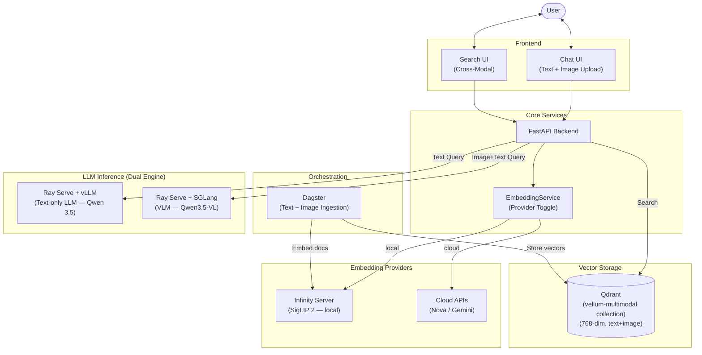

# Multimodal RAG — Text + Image Search with SigLIP 2 + SGLang

## Objective

Evolve Vellum from a text-only RAG system to a **multimodal RAG** supporting text AND image search in a shared embedding space. Users can:

1. **Upload images** to the knowledge base alongside PDFs.
2. **Search across modalities** — a text query like "architecture diagram" finds both text descriptions AND actual images.
3. **Visual reasoning** — the VLM (Vision-Language Model) can analyze retrieved images and generate contextual responses.

### Dependency

This plan requires the **Infrastructure Migration** ([infra-migration.md](../active/infra-migration.md)) Phases 1-4 to be complete. Specifically:
- KinD cluster with GPU (Phase 1)
- KubeRay + Ray Serve (Phase 2-3)
- Dagster pipeline (Phase 4)
- PVC document storage (Phase 4)
- Istio Ambient (Phase 4)

### Scope Boundaries

| In Scope | Out of Scope (Future) |
|----------|----------------------|
| Text + Image embeddings | Audio embeddings (use Whisper → text first) |
| Image upload + search | Video frame extraction |
| SigLIP 2 via Infinity | ImageBind 6-modality |
| SGLang for VLM | Real-time webcam/microphone |
| Cloud API toggle | Streaming multimodal output |

---

## Architecture Overview

### Target Architecture (After All Phases)



### Dual-Engine Routing Logic

```
Incoming Request
    │
    ├─ Has image attachment? ──── YES ──→ SGLang VLM (image + text reasoning)
    │
    └─ Text only? ──────────── YES ──→ vLLM (fast text generation)
```

Both engines expose OpenAI-compatible `/v1/chat/completions`. The backend routes based on input modality. The API contract is identical — only the endpoint URL differs.

### Resource Impact

| Component | RAM | GPU VRAM | Notes |
|-----------|-----|----------|-------|
| **Infinity + SigLIP 2** | ~1 GB | ~1 GB (or CPU-only) | Replaces TEI (~2 GB). Net savings if GPU mode. |
| **SGLang + VLM** | ~2 GB | ~4 GB | Qwen3.5-VL 4B. Shares GPU with vLLM (time-sliced). |
| **Qdrant** (larger collection) | ~0.7 GB | — | More vectors from images. +0.2 GB vs text-only. |
| **Additional total** | **~3.7 GB** | **~5 GB** | VLM is the main GPU consumer |

> ⚠️ **GPU Budget**: On an RTX 4090 (24 GB VRAM), running vLLM (~4 GB) + SGLang VLM (~4 GB) + Infinity SigLIP 2 (~1 GB) = ~9 GB. Comfortable. On RTX 3080 (10 GB), use CPU-mode Infinity and time-share the GPU between vLLM and SGLang.

---

## Architectural Decisions & Tradeoffs

### Decision 1: Infinity replaces TEI (NOT extend)

**Why replace, not extend:**
- TEI is Rust-based, blazing fast for text. But it **cannot embed images**. There is no "add image support" path for TEI.
- Infinity supports the same text embeddings TEI does, plus CLIP, SigLIP, Jina models for images.
- Infinity provides an OpenAI-compatible API — same contract as TEI, so the backend migration is just a URL change plus adding image support.
- The infra migration plan (Decision 6) should be amended to note TEI is swappable post-Phase 4.

**What changes:**
```yaml
# Before (TEI)
image: ghcr.io/huggingface/text-embeddings-inference:cpu-1.5
command: ["text-embeddings-router"]
args: ["--model-id", "/mnt/models/bge-small-en-v1.5"]

# After (Infinity)
image: michaelf34/infinity:latest
command: ["v2"]
args: ["--model-id", "google/siglip2-base-patch16-256", "--port", "80"]
```

### Decision 2: SigLIP 2 over Jina v4 for local embeddings

**Why SigLIP 2:**
- 400M params (~1 GB VRAM) vs Jina v4's 3.8B params (~8 GB VRAM). On a single-GPU dev machine, SigLIP 2 leaves room for the LLM + VLM.
- Google-maintained, actively developed.
- 768-dim embeddings — reasonable storage in Qdrant.
- Excellent image-text matching quality via contrastive learning.
- Natively supported by Infinity.

**Why NOT Jina v4:**
- 3.8B params competes directly with vLLM for GPU memory.
- Late-interaction (ColBERT) mode requires separate Qdrant collection config and more complex retrieval.
- Overkill for text+image when SigLIP 2 handles the use case well.

### Decision 3: Dual-engine (vLLM + SGLang) NOT replace

**Why keep both:**
- vLLM is already deployed and validated by the time this plan starts (infra migration Phase 3 complete).
- SGLang is specifically needed for vision-language models (RadixAttention, encoder disaggregation).
- Text-only queries don't need SGLang's overhead — vLLM is faster for pure text.
- The OpenAI-compatible API means the backend routing logic is trivial (just switch the URL).
- If SGLang proves superior for everything, vLLM can be retired in a future phase.

**Resource sharing:**
- Both run as separate RayService CRDs in the same Ray cluster.
- GPU time-sharing: the GPU serves whichever model is actively processing. With proper request batching, utilization stays high.

### Decision 4: Text + Image first, audio via Whisper later

**Why not direct audio embedding:**
- ImageBind's audio embeddings are research-quality, not production-quality.
- Whisper → text → text embedding is more accurate for speech/podcast search.
- This avoids the complexity of a 6-modality model.
- Audio support can be added as a Phase 7 backlog item without architectural changes (just add Whisper as a Dagster preprocessing step).

### Decision 5: Cloud API parity via EMBEDDING_PROVIDER toggle

**The pattern:**
```python
# Same pattern as USE_S3_STORAGE
EMBEDDING_PROVIDER=local        # Infinity + SigLIP 2
EMBEDDING_PROVIDER=openai       # text-embedding-3-small (text only)
EMBEDDING_PROVIDER=bedrock      # Amazon Nova Embed (text + image)
EMBEDDING_PROVIDER=google       # Gemini Multimodal Embed (text + image)
```

---

## Prerequisite: Fix Embedding Dimension Mismatch

> ⚠️ **CRITICAL**: Before ANY multimodal work, the existing embedding pipeline has a bug.

**Current state:**
- `run_ingestion.py` uses `BAAI/bge-small-en-v1.5` (384-dim) via TEI
- `rag_service.py` queries with `OpenAIEmbedding text-embedding-3-small` (1536-dim)
- Qdrant `vellum` collection was created with `VectorParams(size=384)`

**These vectors are incompatible.** Query embeddings (1536-dim) cannot match stored vectors (384-dim). This must be fixed before multimodal work begins:

1. Choose ONE embedding model for both ingestion and query.
2. Re-create the Qdrant collection with the correct dimension.
3. Re-ingest all documents.

**Recommended fix (during infra migration Phase 4):**
- Standardize on SigLIP 2 (768-dim) via Infinity for BOTH ingestion and query.
- This naturally transitions into multimodal support.

---

## Phase 1 — Embedding Infrastructure (TEI → Infinity + SigLIP 2)

### Goal
Replace TEI with Infinity serving SigLIP 2. Create `EmbeddingService` abstraction with provider toggle. Fix the dimension mismatch.

### 1.1-1.5: Infinity Deployment

**Updated `deployment/embeddings-service.yaml`:**
```yaml
apiVersion: apps/v1
kind: Deployment
metadata:
  name: embeddings-service
  namespace: vellum
spec:
  replicas: 1
  selector:
    matchLabels:
      app: embeddings-service
  template:
    metadata:
      labels:
        app: embeddings-service
    spec:
      containers:
      - name: infinity
        image: michaelf34/infinity:latest
        resources:
          requests:
            cpu: "2"
            memory: "2Gi"
          limits:
            cpu: "4"
            memory: "4Gi"
        args:
          - "v2"
          - "--model-id"
          - "google/siglip2-base-patch16-256"
          - "--port"
          - "80"
          - "--batch-size"
          - "32"
        ports:
        - containerPort: 80
```

> Note: No GPU requested initially — SigLIP 2 at 400M params runs well on CPU for embedding. Add GPU request (`nvidia.com/gpu: 1`) if latency is a concern.

### 1.6-1.8: EmbeddingService Abstraction

```python
# backend/app/services/embedding_service.py
from abc import ABC, abstractmethod
from typing import Union
from app.core.config import settings


class EmbeddingService(ABC):
    """Unified interface for text and image embeddings."""

    @abstractmethod
    async def embed_text(self, text: str) -> list[float]: ...

    @abstractmethod
    async def embed_image(self, image_bytes: bytes) -> list[float]: ...

    @abstractmethod
    async def embed_texts(self, texts: list[str]) -> list[list[float]]: ...

    @property
    @abstractmethod
    def dimension(self) -> int: ...


class InfinityEmbeddingService(EmbeddingService):
    """Local Infinity server — supports text + image via SigLIP 2."""

    def __init__(self):
        self.base_url = settings.EMBEDDINGS_SERVICE_URL  # http://embeddings-service.vellum.svc/v1

    async def embed_text(self, text: str) -> list[float]:
        import httpx
        async with httpx.AsyncClient() as client:
            response = await client.post(
                f"{self.base_url}/embeddings",
                json={"input": text, "model": settings.MULTIMODAL_EMBEDDING_MODEL},
            )
            return response.json()["data"][0]["embedding"]

    async def embed_image(self, image_bytes: bytes) -> list[float]:
        import httpx
        import base64
        b64 = base64.b64encode(image_bytes).decode()
        async with httpx.AsyncClient() as client:
            response = await client.post(
                f"{self.base_url}/embeddings",
                json={
                    "input": [{"type": "image_url", "image_url": {"url": f"data:image/png;base64,{b64}"}}],
                    "model": settings.MULTIMODAL_EMBEDDING_MODEL,
                },
            )
            return response.json()["data"][0]["embedding"]

    async def embed_texts(self, texts: list[str]) -> list[list[float]]:
        import httpx
        async with httpx.AsyncClient() as client:
            response = await client.post(
                f"{self.base_url}/embeddings",
                json={"input": texts, "model": settings.MULTIMODAL_EMBEDDING_MODEL},
            )
            return [d["embedding"] for d in response.json()["data"]]

    @property
    def dimension(self) -> int:
        return 768  # SigLIP 2


class CloudEmbeddingService(EmbeddingService):
    """Cloud embedding APIs (OpenAI, Bedrock, Gemini). Text+image for Bedrock/Gemini."""
    # Implementation follows same pattern as LLMService provider switching
    ...


def create_embedding_service() -> EmbeddingService:
    if settings.EMBEDDING_PROVIDER == "local":
        return InfinityEmbeddingService()
    return CloudEmbeddingService()

embedding_service = create_embedding_service()
```

### 1.9: Environment Variables

```bash
# .env additions
EMBEDDING_PROVIDER=local
MULTIMODAL_EMBEDDING_MODEL=google/siglip2-base-patch16-256
# Cloud options (uncomment to switch):
# EMBEDDING_PROVIDER=bedrock
# EMBEDDING_PROVIDER=google
```

---

## Phase 2 — Multimodal Ingestion Pipeline

### Goal
Extend the Dagster pipeline to handle images alongside text documents. Store both modalities in a unified Qdrant collection with 768-dim SigLIP 2 vectors.

### 2.1-2.3: Dagster Image Ingestion Asset

```python
# dagster_vellum/assets/image_ingestion.py
from dagster import asset, AssetExecutionContext
from pathlib import Path

SUPPORTED_IMAGE_EXTENSIONS = {".jpg", ".jpeg", ".png", ".webp", ".gif", ".bmp", ".tiff"}

@asset(
    description="Ingest images → embed (SigLIP 2 via Infinity) → upsert (Qdrant)",
    group_name="ingestion",
)
def ingested_images(context: AssetExecutionContext):
    source_path = Path("/data/documents")
    image_files = [
        f for f in source_path.iterdir()
        if f.suffix.lower() in SUPPORTED_IMAGE_EXTENSIONS
    ]
    context.log.info(f"Found {len(image_files)} images to ingest")

    for img_path in image_files:
        # 1. Read image bytes
        image_bytes = img_path.read_bytes()

        # 2. Embed via Infinity (SigLIP 2)
        embedding = embed_image_via_infinity(image_bytes)

        # 3. Upsert to Qdrant with metadata
        upsert_to_qdrant(
            vector=embedding,
            payload={
                "modality": "image",
                "file_name": img_path.name,
                "file_type": img_path.suffix,
                "source_path": str(img_path),
            }
        )

    context.log.info(f"Ingested {len(image_files)} images into Qdrant")
    return {"image_count": len(image_files)}
```

### 2.5: Qdrant Collection Schema

```python
from qdrant_client.http.models import VectorParams, Distance, PayloadSchemaType

# Create multimodal collection
client.create_collection(
    collection_name="vellum-multimodal",
    vectors_config=VectorParams(size=768, distance=Distance.COSINE),
)

# Add payload indexes for efficient filtering
client.create_payload_index(
    collection_name="vellum-multimodal",
    field_name="modality",
    field_schema=PayloadSchemaType.KEYWORD,
)
```

---

## Phase 3 — Cross-Modal Retrieval

### Goal
Enable text queries to find both text chunks AND images. Add modality filtering to the search API.

### Key Change: RAG Service

```python
# Updated rag_service.py query method (sketch)
async def query(self, query_text: str, k: int = 5, modality_filter: str = "all"):
    # Embed the query using the SAME model (SigLIP 2 via Infinity)
    query_vector = await embedding_service.embed_text(query_text)

    # Build Qdrant filter
    filter_condition = None
    if modality_filter != "all":
        from qdrant_client.http.models import Filter, FieldCondition, MatchValue
        filter_condition = Filter(must=[
            FieldCondition(key="modality", match=MatchValue(value=modality_filter))
        ])

    # Search across modalities
    results = self.client.search(
        collection_name="vellum-multimodal",
        query_vector=query_vector,
        query_filter=filter_condition,
        limit=k,
    )

    return [
        {
            "text": hit.payload.get("text", ""),
            "modality": hit.payload["modality"],
            "metadata": hit.payload,
            "score": hit.score,
            "image_path": hit.payload.get("source_path") if hit.payload["modality"] == "image" else None,
        }
        for hit in results
    ]
```

---

## Phase 4 — SGLang VLM Deployment

### Goal
Add SGLang as a second Ray Serve deployment for Vision-Language Model inference. Route image+text requests to SGLang, text-only to vLLM.

### 4.2-4.3: SGLang VLM Setup

```python
# sglang_serve_vlm.py
import sglang as sgl
from fastapi import FastAPI

app = FastAPI()

@sgl.function
def vlm_chat(s, image_data, user_message):
    s += sgl.system("You are a vision-language assistant that can analyze images and answer questions about them.")
    s += sgl.user(sgl.image(image_data) + user_message)
    s += sgl.assistant(sgl.gen("response", max_tokens=2048))
```

**RayService CRD:**
```yaml
apiVersion: ray.io/v1
kind: RayService
metadata:
  name: vlm-service
  namespace: vellum-ray
spec:
  serveConfigV2: |
    applications:
      - name: vlm
        import_path: sglang_serve_vlm:app
        route_prefix: /vlm/v1
  rayClusterConfig:
    workerGroupSpecs:
      - groupName: vlm-gpu
        replicas: 1
        template:
          spec:
            containers:
              - name: ray-worker
                resources:
                  requests:
                    nvidia.com/gpu: 1
```

### 4.5-4.6: Backend Routing

```python
# In llm_service.py
async def _get_llm(self, config: ModelConfig):
    # ... existing providers ...

    elif config.provider == "vlm":
        # SGLang Vision-Language Model
        api_base = settings.VLM_SERVICE_URL  # http://vlm-service.vellum-ray.svc:8000/vlm/v1
        from llama_index.llms.openai_like import OpenAILike
        return OpenAILike(
            model=config.id,
            api_key="dummy",
            api_base=api_base,
            is_chat_model=True,
            max_tokens=2048,
        )
```

**Routing logic (in backend endpoint):**
```python
async def generate_response(self, message, context, history, images=None, model_id=None):
    if images:
        # Route to SGLang VLM
        return await self.chat_with_vision(messages, images, model_id="vlm")
    else:
        # Route to vLLM (default)
        return await self.chat(messages, model_id)
```

---

## Phase 5 — Frontend Multimodal UI

### Goal
Enable image upload in chat, display cross-modal search results, add modality filters.

### Key Frontend Changes

1. **Chat input**: Add image attachment button (📎) alongside text input.
2. **Search results**: Mixed display — text chunks as cards, images as thumbnails with source labels.
3. **Admin page**: Extend file upload from "PDF only" to "PDF + Images" (`.jpg`, `.png`, `.webp`).
4. **Modality filter**: Toggle in search bar — `All` | `Text` | `Images`.

---

## Phase 6 — Cloud API Parity + Finalization

### Goal
Ensure all cloud embedding providers (Bedrock, Gemini) produce compatible vectors and add comprehensive documentation.

### Cloud Provider Compatibility

| Provider | API | Text | Image | Vector Dim | Compatible with SigLIP 2 (768)? |
|----------|-----|------|-------|-----------|-------------------------------|
| Local (Infinity) | OpenAI-compat | ✅ | ✅ | 768 | ✅ Yes |
| Amazon Nova Embed | Bedrock API | ✅ | ✅ | 1024 | ❌ Different dim — requires separate collection or re-projection |
| Google Gemini Embed | Gemini API | ✅ | ✅ | 768 | ✅ Compatible |
| OpenAI | OpenAI API | ✅ | ❌ | 1536 | ❌ No image support |

> ⚠️ **Dimension mismatch across providers**: Cloud providers may use different dimensions than SigLIP 2. Options: (a) separate Qdrant collections per provider, (b) linear projection layer to normalize dimensions, (c) standardize on one provider per deployment.

---

## Risk Assessment

| Risk | Severity | Mitigation |
|------|----------|------------|
| Infinity doesn't support SigLIP 2 natively | Medium | Verify model compatibility before Phase 1. Fallback: CLIP ViT-B/32 (well-supported). |
| SigLIP 2 image-text quality insufficient | Medium | Benchmark on sample queries in Phase 1.10. Fallback: upgrade to Jina v4 if GPU allows. |
| GPU VRAM contention (vLLM + SGLang + Infinity) | High | Run Infinity on CPU. Time-share GPU between vLLM and SGLang. Monitor in Phase 4. |
| Cross-provider dimension mismatch | Medium | Standardize on `google` provider (768-dim) for cloud parity. Or use per-deployment collection. |
| SGLang Ray Serve integration issues | Medium | SGLang can also run standalone (no Ray). Fallback: deploy as separate K8s Deployment. |
| Existing dimension mismatch (384 vs 1536) | High | Fix as prerequisite (P0) before any multimodal work. Re-index entire collection. |

## Decision Log

| Decision | Rationale |
|----------|-----------|
| SigLIP 2 over Jina v4 | 400M params fits single-GPU dev. Jina v4 (3.8B) competes with LLM for VRAM. |
| Infinity replaces TEI | TEI cannot embed images. Dead end for multimodal. |
| Dual engine (vLLM + SGLang) | vLLM is battle-tested for text. SGLang is superior for VLM. Route by input modality. |
| Text + Image first | Highest ROI. Audio via Whisper→text later. Video frames later. |
| Separate plan from infra migration | Feature addition, not infrastructure. Avoids bloating 1200+ line plan. |
| EMBEDDING_PROVIDER toggle | Same pattern as USE_S3_STORAGE. Cloud/local flexibility. |
